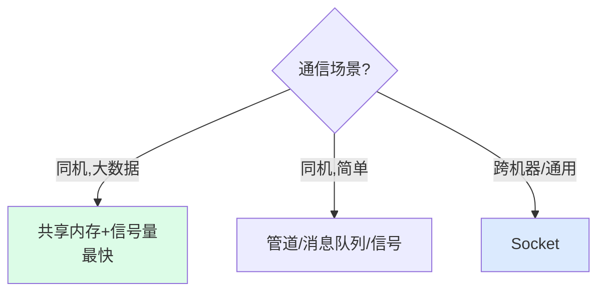

---
tags:
  - basic-knowledge
  - kb/os
  - kb/os/ipc
  - ipc
  - zero-copy
  - sendfile
  - mmap
---

# 进程间通信（IPC）与零拷贝

> 进程内存隔离，通信要靠 **IPC**；高效传输靠**零拷贝**。两者都是 OS/后端中高级面试高频。

## 相关笔记

- [进程、线程、协程](进程、线程、协程.md)：进程基础
- [select、poll、epoll](select、poll、epoll.md)：socket 通信底层
- [linux的fd和inode区别](linux的fd和inode区别.md)

---

## 一、进程间通信（IPC）

进程内存独立隔离，要交换数据必须通过内核提供的 IPC 机制：

| 方式                 | 原理                     | 特点                                 | 适用               |
| -------------------- | ------------------------ | ------------------------------------ | ------------------ |
| **管道 pipe**        | 半双工字节流，父子进程   | 简单，只能父子/兄弟                  | 简单数据流         |
| **命名管道 FIFO**    | 文件系统中的管道         | 任意进程可用                         | 简单跨进程         |
| **消息队列**         | 内核维护的消息链表       | 格式化消息、独立于进程               | 异步通信           |
| **共享内存** ⭐      | 多进程映射同一块物理内存 | **最快**（直接内存读写，无内核拷贝） | 大数据量高频通信   |
| **信号量 semaphore** | 计数器，控制同步互斥     | 配合共享内存用                       | 同步互斥           |
| **信号 signal**      | 软中断（如 SIGKILL）     | 异步通知                             | 简单事件通知       |
| **Socket** ⭐        | 网络或本地通信           | **跨机器**，最通用                   | 网络通信、本地 IPC |

> **共享内存最快**：直接读写同一物理内存，无内核态拷贝；但需信号量保证同步。

---

## 二、零拷贝（Zero-Copy）

### 传统文件传输的拷贝（4 次拷贝 + 4 次上下文切换）

读文件发到网络，传统方式数据要**多次在内核态/用户态间拷贝**：

- `read()`：磁盘→内核缓冲→**用户缓冲**（2次拷贝，1次系统调用）
- `write()`：用户缓冲→**Socket缓冲**→网卡（2次拷贝，1次系统调用）
- 数据白白经过用户态，**4次拷贝 + 4次上下文切换**

### 零拷贝（2 次拷贝，全程不进用户态）

**sendfile / mmap** 技术，数据**全程在内核态**，不拷贝到用户缓冲：

| 技术         | 原理                                | 拷贝次数          |
| ------------ | ----------------------------------- | ----------------- |
| **sendfile** | 内核直接把文件描述符数据传到 socket | **2次（全 DMA）** |
| **mmap**     | 文件映射到进程内存，省一次 CPU 拷贝 | 3次               |
| **splice**   | 管道零拷贝                          | 2次               |

> 零拷贝把「4次拷贝+4次切换」降到「2次 DMA 拷贝+2次切换」，**性能大幅提升**。

### 应用

- **Kafka**：用 sendfile 零拷贝 + 顺序写 + 页缓存，是高吞吐关键
- **Nginx**：静态文件用 sendfile
- **RocketMQ/Netty**：mmap

---

## 三、面试速答

> **Q：进程间通信有哪些方式？**
> A：管道、命名管道、消息队列、共享内存、信号量、信号、Socket。最快是**共享内存**（直接读写同一内存）；最通用是 **Socket**（能跨机器）。

> **Q：什么是零拷贝？解决什么问题？**
> A：传统文件传输数据要在内核/用户态间多次拷贝（4次）。零拷贝用 sendfile/mmap 让数据**全程在内核态**，不进用户缓冲，降到 2 次 DMA 拷贝，减少 CPU 拷贝和上下文切换。

> **Q：Kafka 为什么快？**
> A：① 顺序写磁盘；② 页缓存（PageCache）；③ **零拷贝 sendfile**；④ 批量/压缩。零拷贝是网络传输高性能的关键之一。

> **Q：共享内存为什么最快？**
> A：多个进程映射同一块物理内存，直接读写，无需内核态拷贝。但要配信号量保证同步互斥。

---

## 参考

- [Linux 进程间通信](https://www.kernel.org/doc/html/latest/ipc.html)
- [Zero Copy - Linux Journal](https://www.linuxjournal.com/article/6345)
- 《Unix 网络编程》第 15 章
- [Kafka 高性能 - sendfile](https://kafka.apache.org/documentation/)
