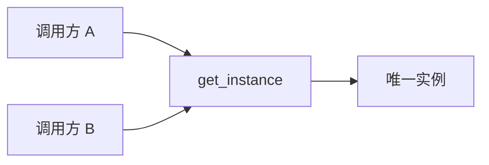

---
tags:
  - basic-knowledge
  - kb/design-pattern
  - kb/design-pattern/creational
  - singleton
---

# 单例模式

> 单例模式保证一个类在**特定作用域**内只有一个实例，并提供统一访问方式。它的重点是控制实例生命周期，而不只是“少执行几次 `new`”。

## 结构与适用场景



适合：

- 进程内配置快照；
- 进程内注册中心；
- 创建成本很高且确实应共享的资源管理器。

不适合：

- 普通无状态工具类；
- 需要在测试中替换的依赖；
- 数据库连接本身——生产环境通常需要的是**连接池**，不是一个全局连接；
- 跨进程唯一资源——单例只能保证当前进程内唯一。

## Python 实现

Python 模块天然只初始化一次，很多场景直接使用模块对象即可。确实需要类级单例时，可以控制 `__new__`：

```python
from threading import Lock

class Settings:
    _instance = None
    _lock = Lock()

    def __new__(cls):
        if cls._instance is None:
            with cls._lock:
                if cls._instance is None:
                    cls._instance = super().__new__(cls)
        return cls._instance

    def __init__(self):
        if getattr(self, "_initialized", False):
            return
        self.debug = False
        self._initialized = True
```

注意：`__new__` 每次都可能返回同一对象，但 `__init__` 仍可能重复调用，因此初始化需要保护。

## 更推荐的替代方案

```python
class App:
    def __init__(self, settings, repository):
        self.settings = settings
        self.repository = repository
```

由应用入口创建一次依赖并显式注入，通常比全局单例更容易测试，也更清晰。

## 常见问题

| 问题 | 结论 |
|---|---|
| 单例能保证多进程唯一吗？ | 不能，每个进程都有独立内存；需文件锁、数据库或分布式协调 |
| 单例一定线程安全吗？ | 不一定，延迟初始化需要同步 |
| 为什么单例常被批评？ | 隐式全局状态、依赖不透明、测试隔离困难 |
| 数据库类适合单例吗？ | 通常管理连接池实例，而不是单个连接 |

> [!tip] 面试回答
> 单例控制进程内唯一实例，但会引入全局状态和测试问题。工程中优先依赖注入或模块级对象；只有生命周期和唯一性确实是业务约束时才使用。

## 相关笔记

- [工厂模式](工厂模式.md)
- [注册树模式](注册树模式.md)
- [动态创建类](动态创建类.md)

## 参考

- 《Design Patterns》· Singleton
- [Python Data Model · object.__new__](https://docs.python.org/3/reference/datamodel.html#object.__new__)
