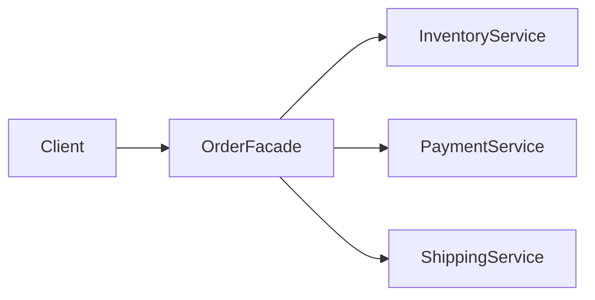

---
tags:
  - basic-knowledge
  - kb/design-pattern
  - kb/design-pattern/structural
  - facade
---

# 外观模式

> 外观模式为复杂子系统提供一个更简单、稳定的高层入口，让调用方不必理解多个内部组件的调用顺序和协作细节。



## Python 示例

```python
class OrderFacade:
    def __init__(self, inventory, payment, shipping):
        self.inventory = inventory
        self.payment = payment
        self.shipping = shipping

    def place_order(self, user_id: str, sku: str, amount: float) -> str:
        reservation = self.inventory.reserve(sku)
        try:
            payment_id = self.payment.charge(user_id, amount)
            return self.shipping.create(reservation, payment_id)
        except Exception:
            self.inventory.release(reservation)
            raise
```

调用方只调用 `place_order()`，内部仍可以直接暴露给少数高级场景，但常规业务依赖 Facade。

## 适用场景

- 对外提供 SDK；
- 为复杂模块提供应用服务层；
- 隔离遗留系统或第三方子系统；
- 希望减少调用方与多个内部模块的耦合。

## 与适配器区别

| 外观 | 适配器 |
|---|---|
| 简化一个或多个子系统 | 转换一个不兼容接口 |
| 通常定义新的高层用例接口 | 通常实现调用方已期望的目标接口 |

## 常见误区

- Facade 不应变成包含全部业务的“上帝类”；
- 事务、补偿和错误语义仍需明确；
- 只做无意义的一对一转发不会带来真正价值。

> [!tip] 面试回答
> 外观模式通过高层入口隐藏复杂子系统，降低调用方耦合。它不是禁止访问子系统，也不是接口适配；关键是提供有业务意义的简化用例。

## 相关笔记

- [适配器模式](适配器模式.md)
- [代理模式](代理模式.md)
- [设计模式索引](设计模式索引.md)

## 参考

- 《Design Patterns》· Facade
- [Refactoring.Guru · Facade](https://refactoring.guru/design-patterns/facade)
