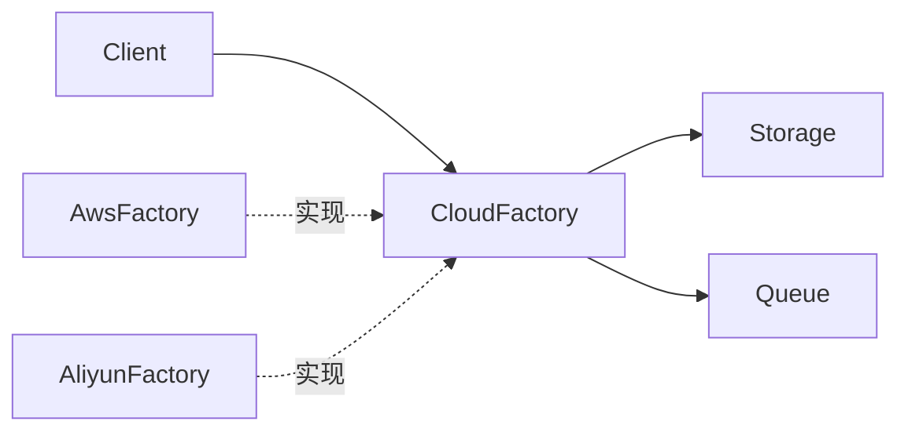

---
tags:
  - basic-knowledge
  - kb/design-pattern
  - kb/design-pattern/creational
  - factory-method
  - abstract-factory
---

# 工厂模式

> 工厂模式把“使用对象”和“创建具体对象”分开，使调用方依赖稳定接口，而不是散落的具体类构造逻辑。

“工厂模式”通常混用了三个概念：

| 类型 | 是否 GoF | 特点 |
|---|---:|---|
| 简单工厂 | 否 | 一个函数根据参数返回不同实现，简单实用 |
| 工厂方法 | 是 | Creator 把创建步骤延迟给子类或可覆盖方法 |
| 抽象工厂 | 是 | 创建一组相互匹配的产品族 |

## 简单工厂

```python
from typing import Protocol

class Sender(Protocol):
    def send(self, message: str) -> None: ...

class EmailSender:
    def send(self, message: str) -> None:
        print(f"email: {message}")

class LarkSender:
    def send(self, message: str) -> None:
        print(f"lark: {message}")

def create_sender(kind: str) -> Sender:
    factories = {
        "email": EmailSender,
        "lark": LarkSender,
    }
    try:
        return factories[kind]()
    except KeyError as exc:
        raise ValueError(f"unsupported sender: {kind}") from exc
```

调用方只依赖 `Sender`，具体实现集中在创建位置。

## 工厂方法

```python
from abc import ABC, abstractmethod

class Exporter(ABC):
    @abstractmethod
    def export(self, data: list[dict]) -> bytes: ...

class CsvExporter(Exporter):
    def export(self, data: list[dict]) -> bytes:
        return b"csv-data"

class ExportJob(ABC):
    @abstractmethod
    def create_exporter(self) -> Exporter: ...

    def run(self, data: list[dict]) -> bytes:
        exporter = self.create_exporter()
        return exporter.export(data)

class CsvExportJob(ExportJob):
    def create_exporter(self) -> Exporter:
        return CsvExporter()
```

父类固定业务流程，子类决定创建哪种产品。

## 抽象工厂

抽象工厂用于创建产品族，例如 AWS 工厂同时创建 Storage 和 Queue，阿里云工厂创建另一组相匹配的 Storage 和 Queue。



## 什么时候使用

- 具体实现由配置、运行环境或租户决定；
- 创建过程复杂，包含校验、默认值或资源装配；
- 希望业务层不直接依赖第三方 SDK；
- 需要保证一组产品相互兼容。

## 常见误区

- 工厂不等于“把 `new` 搬到另一个类”；它必须降低依赖或集中创建规则；
- Python 中简单字典工厂经常比大量 Creator 子类更合适；
- 如果只有一个实现且没有变化点，直接构造最清楚。

> [!tip] 面试回答
> 简单工厂是参数分支；工厂方法通过继承把创建延迟给子类；抽象工厂创建相关产品族。三者的共同目标是让业务代码依赖抽象而不是具体类。

## 相关笔记

- [建造者模式](建造者模式.md)
- [策略模式](策略模式.md)
- [注册树模式](注册树模式.md)

## 参考

- 《Design Patterns》· Factory Method / Abstract Factory
- [Refactoring.Guru · Factory Method](https://refactoring.guru/design-patterns/factory-method)
