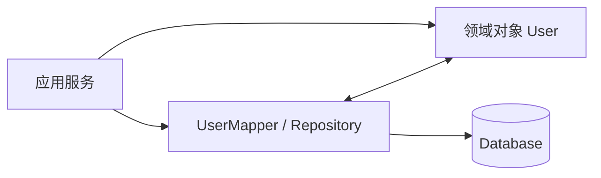

---
tags:
  - basic-knowledge
  - kb/design-pattern
  - data-mapper
  - orm
---

# 数据映射器模式（Data Mapper）

> Data Mapper 在领域对象与数据库之间增加独立映射层，使领域对象不需要知道 SQL、表结构或持久化细节。它属于企业应用架构模式，不是 GoF 23 种模式。



## Python 示例

```python
from dataclasses import dataclass

@dataclass
class User:
    id: int
    name: str

class UserMapper:
    def __init__(self, connection):
        self.connection = connection

    def find(self, user_id: int) -> User | None:
        row = self.connection.execute(
            "SELECT id, name FROM users WHERE id = ?", (user_id,)
        ).fetchone()
        return User(id=row[0], name=row[1]) if row else None

    def save(self, user: User) -> None:
        self.connection.execute(
            "UPDATE users SET name = ? WHERE id = ?",
            (user.name, user.id),
        )
```

`User` 只表达领域数据和行为；`UserMapper` 负责 SQL 与对象转换。

## 与 Active Record 的区别

| 模式 | 持久化位置 | 适合场景 |
|---|---|---|
| Active Record | 对象自己提供 `save()`、`delete()` | CRUD 为主、领域逻辑简单 |
| Data Mapper | 独立 Mapper/Repository 持久化对象 | 复杂领域、希望与数据库解耦 |

很多 ORM 可以同时支持两种风格，关键看业务代码的依赖方向，而不是是否使用 ORM。

## 常见误区

- Data Mapper 不只是“把查询结果封装成对象”；核心是隔离领域与持久化；
- 不应依赖析构方法自动写库，析构时机不可靠，异常处理也困难；
- `save()` 中需要明确事务边界，复杂场景可结合 Unit of Work；
- Mapper 不应混入业务规则。

> [!tip] 面试回答
> Data Mapper 让领域对象保持持久化无知，由 Mapper 或 Repository 负责对象与数据行转换。相比 Active Record，它更适合复杂领域，但代码和映射成本更高。

## 相关笔记

- [工厂模式](工厂模式.md)
- [注册树模式](注册树模式.md)
- [事务](../mysql/事务.md)

## 参考

- Martin Fowler · [Data Mapper](https://martinfowler.com/eaaCatalog/dataMapper.html)
- Martin Fowler，《Patterns of Enterprise Application Architecture》
