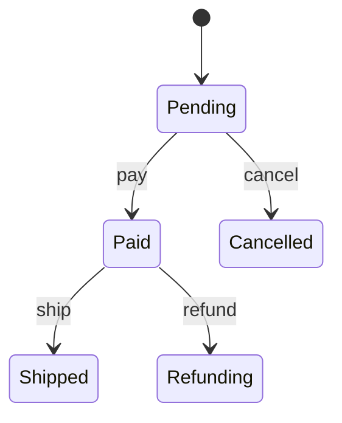

---
tags:
  - basic-knowledge
  - kb/design-pattern
  - kb/design-pattern/behavioral
  - state-pattern
  - state-machine
---

# 状态模式

> 状态模式把不同状态下的行为封装到独立状态对象中，使对象在状态变化时切换行为，避免一个方法里堆积大量状态判断。



## Python 示例

```python
from typing import Protocol

class OrderState(Protocol):
    def pay(self, order: "Order") -> None: ...
    def cancel(self, order: "Order") -> None: ...

class Pending:
    def pay(self, order: "Order") -> None:
        order.state = Paid()

    def cancel(self, order: "Order") -> None:
        order.state = Cancelled()

class Paid:
    def pay(self, order: "Order") -> None:
        raise ValueError("order already paid")

    def cancel(self, order: "Order") -> None:
        raise ValueError("paid order must refund")

class Cancelled:
    def pay(self, order: "Order") -> None:
        raise ValueError("cancelled order cannot be paid")

    def cancel(self, order: "Order") -> None:
        pass

class Order:
    def __init__(self):
        self.state: OrderState = Pending()

    def pay(self) -> None:
        self.state.pay(self)
```

## 状态与策略的区别

| 状态模式 | 策略模式 |
|---|---|
| 行为由内部状态决定 | 算法通常由调用方选择 |
| 状态之间存在迁移规则 | 策略之间通常相互独立 |
| 关注对象生命周期 | 关注算法替换 |

## 常见误区

- 状态很少且逻辑简单时，枚举加显式状态机更清楚；
- 状态迁移、权限和副作用应集中管理；
- 分布式工作流还需处理幂等、并发和持久化，单纯 State 对象不够。

> [!tip] 面试回答
> 状态模式通过多态消除复杂状态分支，每个状态封装允许的行为和迁移。适合订单、任务和连接生命周期；简单状态机不必强行拆成很多类。

## 相关笔记

- [策略模式](策略模式.md)
- [设计模式索引](设计模式索引.md)
- [分布式事务](../分布式&高并发/分布式事务.md)

## 参考

- 《Design Patterns》· State
- [Refactoring.Guru · State](https://refactoring.guru/design-patterns/state)
