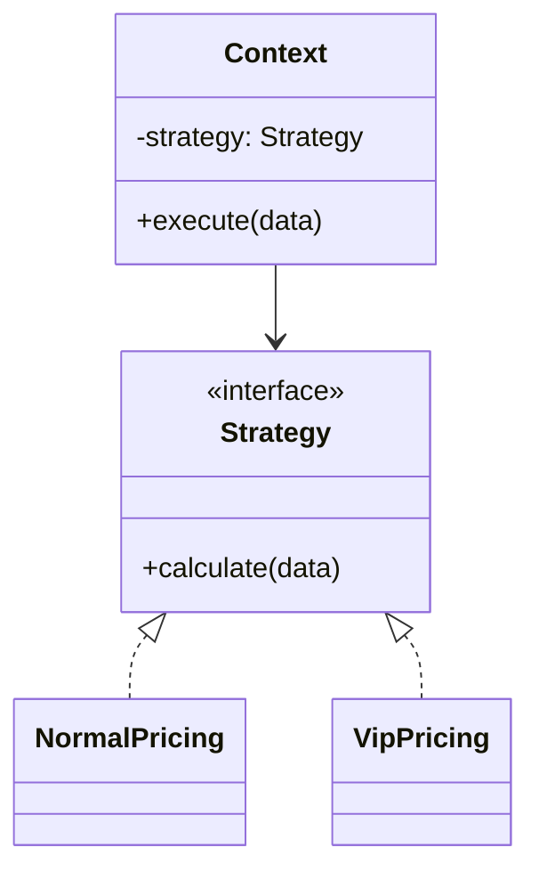

---
tags:
  - basic-knowledge
  - kb/design-pattern
  - kb/design-pattern/behavioral
  - strategy
---

# 策略模式

> 策略模式把一组可替换的算法封装为统一接口，调用方通过组合选择算法，而不把大量条件分支写进核心业务。

## 结构



## Python 示例：计价策略

```python
from typing import Protocol

class PricingStrategy(Protocol):
    def calculate(self, amount: float) -> float: ...

class NormalPricing:
    def calculate(self, amount: float) -> float:
        return amount

class VipPricing:
    def calculate(self, amount: float) -> float:
        return amount * 0.8

class Checkout:
    def __init__(self, pricing: PricingStrategy):
        self.pricing = pricing

    def total(self, amount: float) -> float:
        return self.pricing.calculate(amount)

checkout = Checkout(VipPricing())
print(checkout.total(100))  # 80.0
```

Python 中策略也可以是满足相同签名的普通函数，不一定必须定义类。

## 适用场景

- 同一业务存在多套算法：计费、排序、路由、重试、推荐；
- 条件分支主要在选择算法，而算法本身相对独立；
- 需要运行时切换或测试不同实现。

## 与其他模式的区别

| 模式 | 主要目的 |
|---|---|
| 策略 | 替换算法，接口通常保持不变 |
| 适配器 | 转换不兼容接口 |
| 状态 | 对象因内部状态变化而自动切换行为 |
| 模板方法 | 用继承固定流程骨架，策略用组合替换某一步或整套算法 |

## 常见误区

- 两个简单分支不一定需要策略模式；
- 策略对象不应同时承担选择策略的职责；
- 调用方必须知道可选策略时，可增加工厂或配置层，但不要隐藏重要业务规则。

> [!tip] 面试回答
> 策略模式用组合替代条件分支和继承扩展。Context 依赖统一策略接口，具体算法可以独立新增、替换和测试；代价是类或函数数量增加，调用方需要选择策略。

## 相关笔记

- [工厂模式](工厂模式.md)
- [适配器模式](适配器模式.md)
- [设计模式索引](设计模式索引.md)

## 参考

- 《Design Patterns》· Strategy
- [Refactoring.Guru · Strategy](https://refactoring.guru/design-patterns/strategy)
