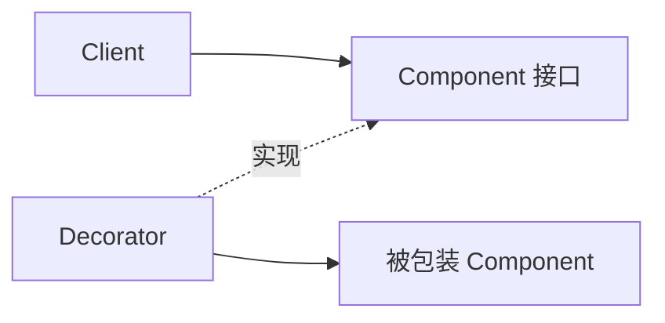

---
tags:
  - basic-knowledge
  - kb/design-pattern
  - kb/design-pattern/structural
  - decorator-pattern
---

# 装饰器模式

> 装饰器模式用包装对象在运行时叠加职责，同时保持与原对象相同的接口，避免通过大量子类组合功能。



## Python 示例：为存储增加日志和缓存

```python
from typing import Protocol

class Repository(Protocol):
    def get(self, key: str) -> str | None: ...

class DbRepository:
    def get(self, key: str) -> str | None:
        return f"db:{key}"

class LoggingRepository:
    def __init__(self, wrapped: Repository):
        self.wrapped = wrapped

    def get(self, key: str) -> str | None:
        print(f"get {key}")
        return self.wrapped.get(key)

class CacheRepository:
    def __init__(self, wrapped: Repository):
        self.wrapped = wrapped
        self.cache: dict[str, str] = {}

    def get(self, key: str) -> str | None:
        if key not in self.cache:
            value = self.wrapped.get(key)
            if value is not None:
                self.cache[key] = value
        return self.cache.get(key)
```

```python
repo = LoggingRepository(CacheRepository(DbRepository()))
```

## 与 Python `@decorator` 的关系

Python 函数装饰器也是“包装并增强行为”，思想相近，但 GoF 装饰器主要描述对象组合结构，不等同于 `@` 语法本身。

## 适用场景

- 日志、重试、缓存、指标；
- 中间件式能力组合；
- 不修改原类的情况下增加可选功能。

## 与代理、适配器区别

| 模式 | 接口 | 目的 |
|---|---|---|
| 装饰器 | 保持 | 增加职责 |
| 代理 | 保持 | 控制访问 |
| 适配器 | 改变 | 解决接口不兼容 |

## 常见误区

- 包装顺序可能改变语义，例如“先重试再计时”与“先计时再重试”；
- 装饰层过多会让调用栈和调试复杂；
- 装饰器必须尽量遵守原接口契约。

> [!tip] 面试回答
> 装饰器通过组合在运行时叠加功能，避免子类爆炸。它与代理结构相似，但意图是增强而不是访问控制。

## 相关笔记

- [代理模式](代理模式.md)
- [适配器模式](适配器模式.md)
- [装饰器](../python/装饰器.md)

## 参考

- 《Design Patterns》· Decorator
- [Refactoring.Guru · Decorator](https://refactoring.guru/design-patterns/decorator)
