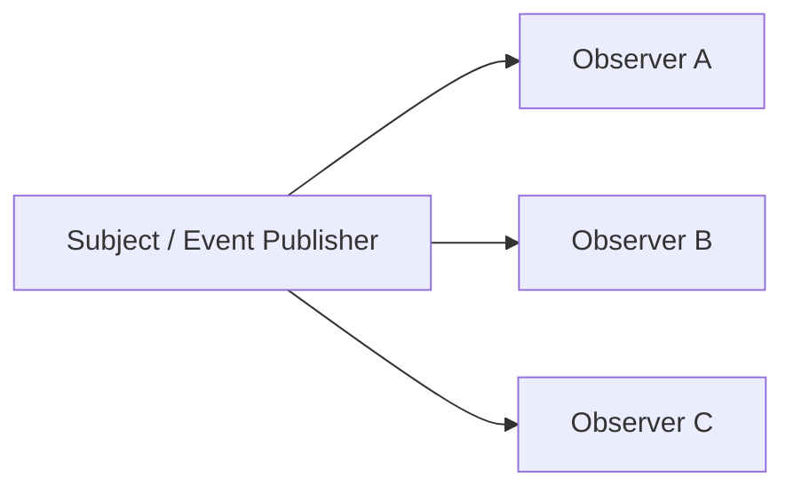

---
tags:
  - basic-knowledge
  - kb/design-pattern
  - kb/design-pattern/behavioral
  - observer
  - event-driven
---

# 观察者模式

> 观察者模式建立一对多订阅关系：主题发生变化时，主动通知所有观察者。它适合进程内事件解耦，但不等同于消息队列。



## Python 示例

```python
from collections.abc import Callable

class EventBus:
    def __init__(self):
        self._handlers: dict[str, list[Callable]] = {}

    def subscribe(self, event: str, handler: Callable) -> Callable[[], None]:
        self._handlers.setdefault(event, []).append(handler)

        def unsubscribe() -> None:
            self._handlers[event].remove(handler)
        return unsubscribe

    def publish(self, event: str, payload) -> None:
        for handler in list(self._handlers.get(event, [])):
            handler(payload)
```

```python
def send_email(order):
    print(f"email for order {order['id']}")

bus = EventBus()
unsubscribe = bus.subscribe("order.created", send_email)
bus.publish("order.created", {"id": 1})
unsubscribe()
```

## 适用场景

- 领域事件；
- UI 事件；
- 缓存失效、日志、指标等旁路处理；
- 一个变化需要通知多个互不依赖的模块。

## 与消息队列的区别

| 观察者 | 消息队列 |
|---|---|
| 通常在同一进程内 | 可以跨进程、跨机器 |
| 常为同步调用 | 通常异步、可持久化 |
| 进程退出后事件消失 | 可提供重试、确认和消费语义 |

## 常见误区

- 订阅未取消会造成引用泄漏；
- 一个 Observer 异常不应阻断所有通知，需要明确错误策略；
- 同步回调执行慢会拖慢发布方；
- 业务主流程若必须成功，不应只依赖“尽力通知”。

> [!tip] 面试回答
> 观察者用于一对多通知，降低发布者对具体订阅者的依赖；代价是调用链隐蔽、顺序和异常处理复杂。跨进程可靠事件应使用消息队列或 Outbox 等方案。

## 相关笔记

- [责任链模式](责任链模式.md)
- [设计模式索引](设计模式索引.md)
- [消息队列核心问题](../分布式&高并发/消息队列核心问题.md)

## 参考

- 《Design Patterns》· Observer
- [Refactoring.Guru · Observer](https://refactoring.guru/design-patterns/observer)
