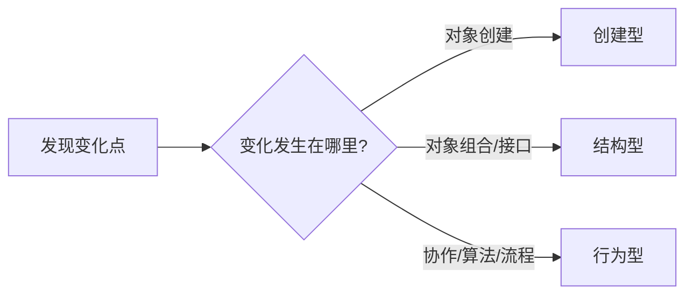

---
tags:
  - basic-knowledge
  - kb/design-pattern
  - design-pattern
  - gof
---

# 设计模式索引

> 设计模式是对重复出现的软件设计问题的命名与经验总结，不是必须套用的代码模板。判断是否使用模式，应从**变化点、依赖方向和维护成本**出发，而不是为了“用了模式”而增加抽象。

## 一、先记住三个分类

| 分类 | 解决的问题 | 典型模式 |
|---|---|---|
| 创建型 | 对象由谁创建、何时创建、如何组合 | 工厂方法、抽象工厂、建造者、原型、单例 |
| 结构型 | 类和对象如何组合，并保持接口稳定 | 适配器、桥接、组合、装饰器、外观、享元、代理 |
| 行为型 | 对象之间如何协作、分配职责和切换行为 | 策略、观察者、责任链、状态、命令、模板方法等 |

## 二、GoF 23 种设计模式

### 创建型模式

| 模式 | 核心意图 | 常见场景 |
|---|---|---|
| 工厂方法 Factory Method | 让子类或具体 Creator 决定创建哪种产品 | 支付渠道、消息发送器、存储驱动 |
| 抽象工厂 Abstract Factory | 创建一组相互匹配的产品族 | 跨平台 UI、不同云厂商资源套件 |
| 建造者 Builder | 分步骤构造复杂对象 | SQL Builder、HTTP Request、复杂配置 |
| 原型 Prototype | 通过复制现有对象创建新对象 | 模板对象、昂贵初始化后的复制 |
| 单例 Singleton | 控制一个类在特定作用域内只有一个实例 | 进程内注册中心、配置快照；通常可被 DI 替代 |

### 结构型模式

| 模式 | 核心意图 | 常见场景 |
|---|---|---|
| 适配器 Adapter | 把不兼容接口转换为调用方需要的接口 | 第三方 SDK、数据库/缓存驱动 |
| 桥接 Bridge | 把抽象与实现拆成两个可独立变化的维度 | 消息类型 × 发送渠道 |
| 组合 Composite | 以统一接口处理单个对象和对象树 | 文件系统、菜单、组织树 |
| 装饰器 Decorator | 不改变接口，运行时叠加职责 | 中间件、重试、缓存、日志 |
| 外观 Facade | 为复杂子系统提供简单统一入口 | SDK 门面、应用服务层 |
| 享元 Flyweight | 共享大量对象的公共状态以节省内存 | 字形、棋子、连接元数据 |
| 代理 Proxy | 用替身控制对真实对象的访问 | 远程代理、延迟加载、权限、缓存 |

### 行为型模式

| 模式 | 核心意图 | 常见场景 |
|---|---|---|
| 责任链 Chain of Responsibility | 请求沿处理器链传递，直到被处理或链结束 | Web 中间件、审批链、校验链 |
| 命令 Command | 把请求封装为对象 | 任务队列、撤销重做、操作审计 |
| 解释器 Interpreter | 为简单语言定义语法与解释规则 | 规则 DSL；复杂语法通常用 Parser |
| 迭代器 Iterator | 不暴露内部结构地遍历集合 | Python 迭代协议、分页遍历 |
| 中介者 Mediator | 用中心对象协调多个对象，减少网状依赖 | UI 表单协调、聊天室 |
| 备忘录 Memento | 在不暴露内部实现时保存和恢复状态 | 编辑器撤销、快照 |
| 观察者 Observer | 一个对象变化时通知多个订阅者 | 领域事件、UI 事件、进程内事件总线 |
| 状态 State | 对象随内部状态改变行为 | 订单、任务、连接状态机 |
| 策略 Strategy | 封装可替换算法，通过组合选择 | 计费、排序、路由、推荐策略 |
| 模板方法 Template Method | 父类固定流程骨架，子类覆盖步骤 | ETL 流程、测试生命周期 |
| 访问者 Visitor | 在不改对象结构时增加一组新操作 | AST、编译器、报表导出 |

## 三、常见模式怎么选

| 如果你的问题是…… | 优先考虑 |
|---|---|
| `if/elif` 持续增加不同算法 | [策略模式](策略模式.md) |
| 第三方接口和系统接口不一致 | [适配器模式](适配器模式.md) |
| 创建对象需要根据配置选择实现 | [工厂模式](工厂模式.md) |
| 构造参数很多、步骤有先后关系 | [建造者模式](建造者模式.md) |
| 希望在原功能外叠加日志、缓存、重试 | [装饰器模式](装饰器模式.md) |
| 访问前需要鉴权、延迟加载或远程调用 | [代理模式](代理模式.md) |
| 一个事件需要通知多个处理者 | [观察者模式](观察者模式.md) |
| 请求要依次经过校验、审批或中间件 | [责任链模式](责任链模式.md) |
| 对象行为由内部状态决定 | [状态模式](状态模式.md) |
| 需要一个简化复杂子系统的入口 | [外观模式](外观模式.md) |

## 四、容易混淆的概念

| 概念 | 区别 |
|---|---|
| 策略 vs 状态 | 策略通常由调用方选择算法；状态由对象内部状态和迁移决定行为 |
| 适配器 vs 装饰器 | 适配器改变接口；装饰器保持接口并增加职责 |
| 装饰器 vs 代理 | 两者结构相似；装饰器强调增强，代理强调访问控制 |
| 工厂方法 vs 抽象工厂 | 工厂方法创建一种产品；抽象工厂创建一组相关产品 |
| Active Record vs Data Mapper | Active Record 对象自己持久化；Data Mapper 由独立 Mapper/Repository 持久化 |
| Registry vs Service Locator | Registry 是映射机制；当业务代码主动从全局 Registry 找依赖时，就形成 Service Locator 反模式风险 |

## 五、使用设计模式的判断标准

适合使用：

- 变化点已经出现，而不是纯猜测；
- 能减少调用方对具体实现的依赖；
- 新增实现时尽量不修改稳定代码；
- 模式名称能帮助团队快速沟通。

不适合使用：

- 只有一个实现且短期没有变化；
- 为了模式增加大量空接口和转发类；
- 简单函数、字典或依赖注入已经足够；
- 抽象后反而更难理解、调试和测试。

> [!tip] 面试回答框架
> 先说模式解决什么变化，再说角色和协作关系，然后给实际场景，最后补充代价与替代方案。不要只背定义。

## 六、扩展模式与语言技术

以下内容常与设计模式一起讨论，但**不属于 GoF 23 种模式**：

- [注册树模式](注册树模式.md)：更准确叫 Registry（注册表）模式；
- [数据对象映射模式](数据对象映射模式.md)：Martin Fowler 企业应用架构模式中的 Data Mapper；
- [动态创建类](动态创建类.md)：Python 元编程技术，不是设计模式。

## 相关笔记

- [面向对象编程](../python/面向对象编程.md)
- [MVC](../python/MVC.md)
- [动态创建类](动态创建类.md)

## 参考

- Erich Gamma 等，《Design Patterns: Elements of Reusable Object-Oriented Software》
- Martin Fowler，《Patterns of Enterprise Application Architecture》
- [Refactoring.Guru · Design Patterns](https://refactoring.guru/design-patterns)
