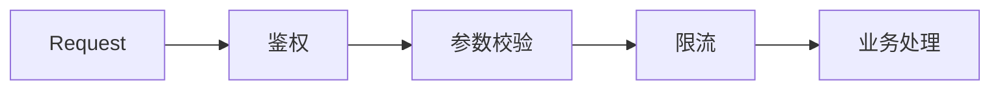

---
tags:
  - basic-knowledge
  - kb/design-pattern
  - kb/design-pattern/behavioral
  - chain-of-responsibility
  - middleware
---

# 责任链模式

> 责任链模式把多个处理器按顺序连接，请求沿链传递；每个处理器可以处理、修改、拒绝或继续传递请求。



## Python 示例

```python
from collections.abc import Callable

Handler = Callable[[dict], dict]
Middleware = Callable[[dict, Handler], dict]

def auth(request: dict, next_handler: Handler) -> dict:
    if not request.get("user"):
        return {"status": 401}
    return next_handler(request)

def validate(request: dict, next_handler: Handler) -> dict:
    if "payload" not in request:
        return {"status": 400}
    return next_handler(request)

def endpoint(request: dict) -> dict:
    return {"status": 200, "data": request["payload"]}

def chain(*middlewares: Middleware) -> Handler:
    handler = endpoint
    for middleware in reversed(middlewares):
        current = handler
        handler = lambda request, m=middleware, n=current: m(request, n)
    return handler

app = chain(auth, validate)
```

## 两种责任链语义

| 语义 | 说明 | 示例 |
|---|---|---|
| 首个处理者终止 | 找到能处理请求的节点后停止 | 异常处理、审批人匹配 |
| 所有节点依次处理 | 每个节点都执行并传递 | Web 中间件、过滤器链 |

## 适用场景

- Web 中间件；
- 参数校验、风控和审批链；
- 日志处理器；
- 需要动态调整处理顺序的流水线。

## 常见误区

- 必须明确谁可以终止链、异常如何传播；
- 顺序是业务语义，不能随意调整；
- 链过长时调试困难，需要 Trace 或处理记录；
- 如果每一步都必须执行且数据依赖复杂，Pipeline/Workflow 可能更准确。

> [!tip] 面试回答
> 责任链让发送者不必知道最终由谁处理，请求按顺序经过处理器。优点是处理器可插拔，代价是调用链和执行结果不够直观。

## 相关笔记

- [观察者模式](观察者模式.md)
- [装饰器模式](装饰器模式.md)
- [限流熔断降级](../分布式&高并发/限流熔断降级.md)

## 参考

- 《Design Patterns》· Chain of Responsibility
- [Refactoring.Guru · Chain of Responsibility](https://refactoring.guru/design-patterns/chain-of-responsibility)
