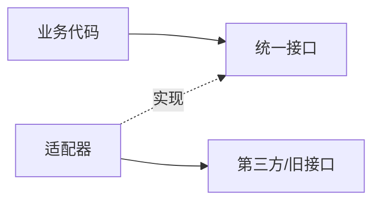

---
tags:
  - basic-knowledge
  - kb/design-pattern
  - kb/design-pattern/structural
  - adapter
---

# 适配器模式

> 适配器模式把已有对象的不兼容接口转换成调用方需要的目标接口，使旧代码或第三方 SDK 可以接入现有系统。



## Python 示例：统一缓存接口

```python
from typing import Protocol

class Cache(Protocol):
    def get(self, key: str) -> str | None: ...
    def set(self, key: str, value: str, ttl: int) -> None: ...

class ThirdPartyRedis:
    def fetch(self, name: str):
        return None

    def put(self, name: str, value: str, expire_seconds: int):
        pass

class RedisAdapter:
    def __init__(self, client: ThirdPartyRedis):
        self.client = client

    def get(self, key: str) -> str | None:
        return self.client.fetch(name=key)

    def set(self, key: str, value: str, ttl: int) -> None:
        self.client.put(name=key, value=value, expire_seconds=ttl)
```

业务层只依赖 `Cache`，第三方参数名、返回值和异常都由 Adapter 转换。

## 两种实现方式

| 方式 | 实现 | 建议 |
|---|---|---|
| 对象适配器 | 组合一个 Adaptee 实例 | 更灵活，优先使用 |
| 类适配器 | 继承 Adaptee 并实现目标接口 | 受语言多继承和父类约束 |

## 适用场景

- 替换数据库、缓存、对象存储和支付 SDK；
- 接入返回格式不同的第三方 API；
- 兼容旧接口，同时逐步迁移新接口；
- 在防腐层隔离外部系统模型。

## 与相似模式区别

- **适配器**：改变接口，让不兼容对象可用；
- **装饰器**：保持接口，增加行为；
- **代理**：保持接口，控制访问；
- **外观**：为整个复杂子系统提供更简单入口。

## 常见误区

- 适配器不应泄漏第三方类型和异常；
- 如果 Adapter 包含大量业务规则，它已经变成业务服务，应拆分；
- 不要为了“统一”抹掉底层能力差异，可通过 Capability 显式表达。

> [!tip] 面试回答
> 适配器位于调用方和旧接口之间，负责参数、返回值和异常转换。它解决接口不兼容问题，不负责选择算法。

## 相关笔记

- [策略模式](策略模式.md)
- [装饰器模式](装饰器模式.md)
- [代理模式](代理模式.md)

## 参考

- 《Design Patterns》· Adapter
- [Refactoring.Guru · Adapter](https://refactoring.guru/design-patterns/adapter)
