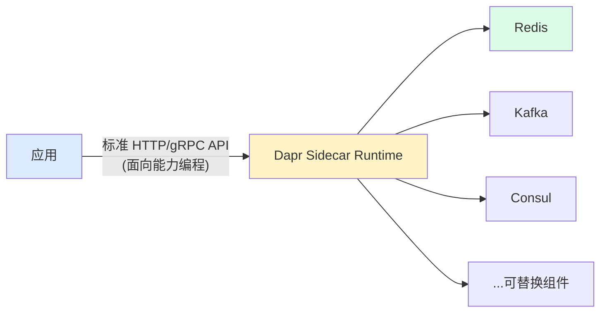
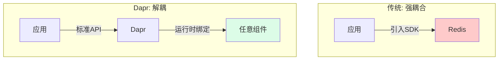

---
tags:
  - basic-knowledge
  - kb/devops
  - dapr
  - service-mesh
  - multi-runtime
---

# Dapr（分布式应用运行时）

> Dapr = **D**istributed **Ap**plication **R**untime，微软发起、CNCF 孵化。是 **Multi-Runtime（Mecha）架构**的代表——把分布式能力抽象为**标准 API**，应用「面向能力编程」，实现跨云可移植。

## 相关笔记

- [微服务架构](../分布式&高并发/微服务架构.md)：Dapr 的背景
- [Redis分布式锁](../redis/Redis分布式锁.md)：Dapr 状态/锁能力的底层之一
- [订餐中台服务设计](../分布式&高并发/订餐中台服务设计.md)：实际用了 Dapr Actor

---

## 一、为什么有 Dapr（Multi-Runtime 趋势）

Service Mesh（Sidecar 模式）成功后，社区发现：应用需要的**其他分布式能力**（状态、锁、消息、配置、可观测）也可以外移到独立 Runtime。多个能力 Runtime 整合，与应用共同组成微服务，即 **Multi-Runtime（Mecha）架构**。

> Dapr 是业界第一个 Multi-Runtime 实践项目。

---

## 二、核心思想：面向能力编程

### 传统方式：面向具体组件编程（强耦合）

应用要用某能力，就引入具体组件的 SDK（如直接用 Redis 客户端），**和组件强耦合**，换组件要改代码。

### Dapr 方式：标准 API + 可替换组件（解耦）

- Dapr 提供**标准 API** 抽象分布式能力（状态、锁、消息等）
- Dapr **Runtime 隔离**应用与底层组件
- 组件**运行时可替换**（换 Redis 为 etcd，应用无感）

---

## 三、可移植性（核心价值）

Dapr 愿景：**any language, any framework, anywhere**

- **any language**：标准 HTTP/gRPC，任何语言都能调
- **any framework**：不绑框架
- **anywhere**：公有云 / 私有云 / 混合云 / 边缘

> 基石是「标准 API + 可插拔组件」，让云原生应用真正跨云跨平台。

---

## 四、Dapr 的能力（Building Blocks）

| 能力            | 说明                                       |
| --------------- | ------------------------------------------ |
| **服务调用**    | 服务间标准调用                             |
| **状态管理**    | 键值状态存储（Redis/etcd/...）             |
| **发布订阅**    | 消息能力（Kafka/RabbitMQ/...）             |
| **Actor**       | Actor 模型（虚拟 Actor，适合有状态长连接） |
| **配置 / 密钥** | 配置与密钥管理                             |
| **可观测性**    | 链路追踪、指标                             |

> 订餐中台用 Dapr 的 **Actor 模型**解决「分布式容器服务寻不到址」的收银机通信痛点（见 [订餐中台服务设计](../分布式&高并发/订餐中台服务设计.md)）。

---

## 五、面试速答

> **Q：Dapr 是什么？解决什么问题？**
> A：分布式应用运行时，Multi-Runtime 架构代表。把分布式能力（状态/锁/消息/Actor）抽象为标准 API，应用面向能力编程，组件运行时可替换，实现跨云可移植——解决应用与具体组件强耦合的问题。

> **Q：Dapr 和 Service Mesh 区别？**
> A：Service Mesh（如 Istio）专注网络通信治理（路由/熔断/可观测）；Dapr 更上层，抽象业务级分布式能力（状态/锁/消息/Actor/配置），是 Multi-Runtime。两者可共存。

> **Q：Dapr 怎么实现可移植性？**
> A：标准 API（HTTP/gRPC）+ 可插拔组件。应用只调标准 API，底层组件运行时绑定，换云换组件应用无感。

---

## 参考

- [Dapr 官方](https://dapr.io/)
- [Dapr 文档](https://docs.dapr.io/)
- [Multi-Runtime 架构（Mecha）](https://www.infoq.com/articles/multi-runtime-microservices-architecture/)
