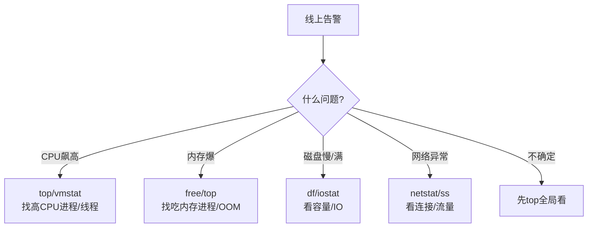
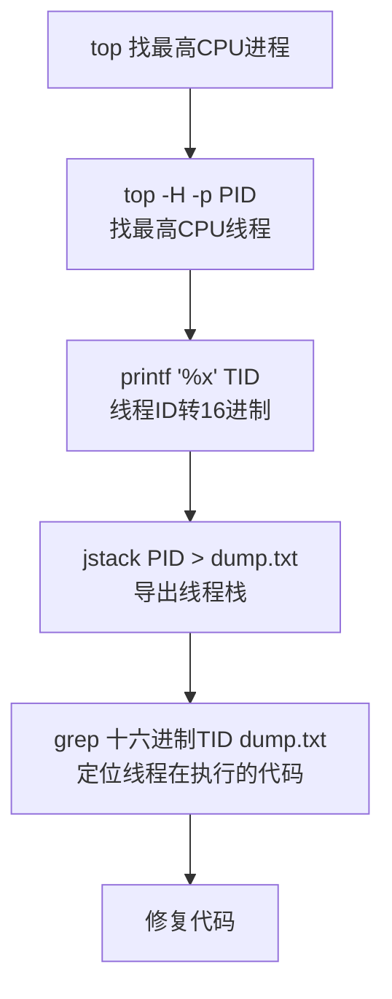

---
tags:
  - basic-knowledge
  - kb/devops
  - kb/os/linux
  - linux
  - performance
  - troubleshooting
---

# Linux 常用命令与性能排查

> 后端面试常考「线上 CPU/内存/磁盘/网络 飙高怎么排查」。掌握**性能排查四件套**是必备技能。

## 相关笔记

- [进程、线程、协程](../计算机原理/进程、线程、协程.md)
- [进程间通信与零拷贝](../计算机原理/进程间通信与零拷贝.md)
- [linux的fd和inode区别](../计算机原理/linux的fd和inode区别.md)

---

## 一、性能排查四件套（核心）

线上故障无非 CPU、内存、磁盘、网络四类，各有对应工具：

### 1. CPU 排查

| 命令              | 作用                                               |
| ----------------- | -------------------------------------------------- |
| `top` / `htop`    | 全局看 CPU/内存占用，找高占用进程（按 P 排序 CPU） |
| `top -H -p <pid>` | 看某进程的**线程**级 CPU（找高 CPU 线程）          |
| `vmstat 1`        | 看 CPU 上下文切换、运行队列（`r`列、`cs`列）       |

> 高 CPU 流程：`top` 找进程 → `top -H -p` 找线程 → `jstack`（Java）/`perf`（C）/`py-spy`（Python）看线程在干嘛。

### 2. 内存排查

| 命令               | 作用                                       |
| ------------------ | ------------------------------------------ |
| `free -h`          | 总体内存（关注 `available`、cache/buffer） |
| `top`（按 M 排序） | 找吃内存进程                               |
| `vmstat`           | swap、内存                                 |
| `dmesg             | grep OOM`                                  | 查 OOM Killer 记录 |

### 3. 磁盘排查

| 命令          | 作用                                        |
| ------------- | ------------------------------------------- |
| `df -h`       | 磁盘容量（是否满了）                        |
| `iostat -x 1` | IO 负载（`%util`、`await`，看磁盘是否打满） |
| `du -sh *`    | 找大目录                                    |
| `iotop`       | 哪个进程在疯狂读写磁盘                      |

### 4. 网络排查

| 命令                             | 作用                           |
| -------------------------------- | ------------------------------ |
| `ss -tnp`                        | TCP 连接（替代 netstat，更快） |
| `netstat -anp`                   | 连接、端口、监听               |
| `tcpdump`                        | 抓包分析                       |
| `ping` / `telnet` / `traceroute` | 连通性                         |
| `iftop`                          | 实时流量（哪个连接占带宽）     |

---

## 二、日常常用命令

### 文本处理（三剑客）

| 命令                       | 作用                         |
| -------------------------- | ---------------------------- |
| `grep`                     | 文本搜索                     |
| `awk`                      | 列处理（`awk '{print $1}'`） |
| `sed`                      | 流编辑（替换）               |
| `find /path -name "*.log"` | 找文件                       |
| `tail -f xxx.log`          | 实时看日志                   |
| `                          | `管道 /`>` 重定向            | 组合命令 |

### 进程与系统

| 命令                          | 作用                 |
| ----------------------------- | -------------------- |
| `ps aux` / `ps -ef`           | 查进程               |
| `kill -9 <pid>`               | 强杀进程             |
| `systemctl status/start/stop` | 服务管理             |
| `uptime`                      | 负载（load average） |
| `lsof -i:8080`                | 谁占了端口           |

---

## 三、经典排查流程：CPU 100% 怎么办

---

## 四、面试速答

> **Q：线上 CPU 飙高怎么排查？**
> A：`top` 找高 CPU 进程 → `top -H -p <pid>` 找高 CPU 线程 → 线程 ID 转十六进制 → `jstack`（Java）或 `perf`/`py-spy` 导出该线程栈，定位到具体代码。

> **Q：内存 OOM 怎么排查？**
> A：`free -h` 看总体、`top` 按内存排序找吃内存进程；`dmesg | grep OOM` 看是否被 OOM Killer 杀；应用层导出堆 dump 分析（Java 用 jmap/MAT）。

> **Q：磁盘慢怎么查？**
> A：`df -h` 看是否满；`iostat -x` 看 `%util`（接近100%说明打满）和 `await`（高说明慢）；`iotop` 找疯狂 IO 的进程。

> **Q：常用排查命令？**
> A：CPU 用 top/vmstat，内存用 free，磁盘用 df/iostat，网络用 ss/netstat/tcpdump；文本三剑客 grep/awk/sed。

---

## 参考

- [Linux Performance (Brendan Gregg)]<http://www.brendangregg.com/linuxperf.html>)
- [Linux 命令大全](https://www.runoob.com/linux/linux-command-manual.html)
- 《性能之巅》Brendan Gregg
- [线上排查手册](https://github.com/cncounter/translation/blob/master/tiemao_2020/07_linux-performance/linux-performance.md)
