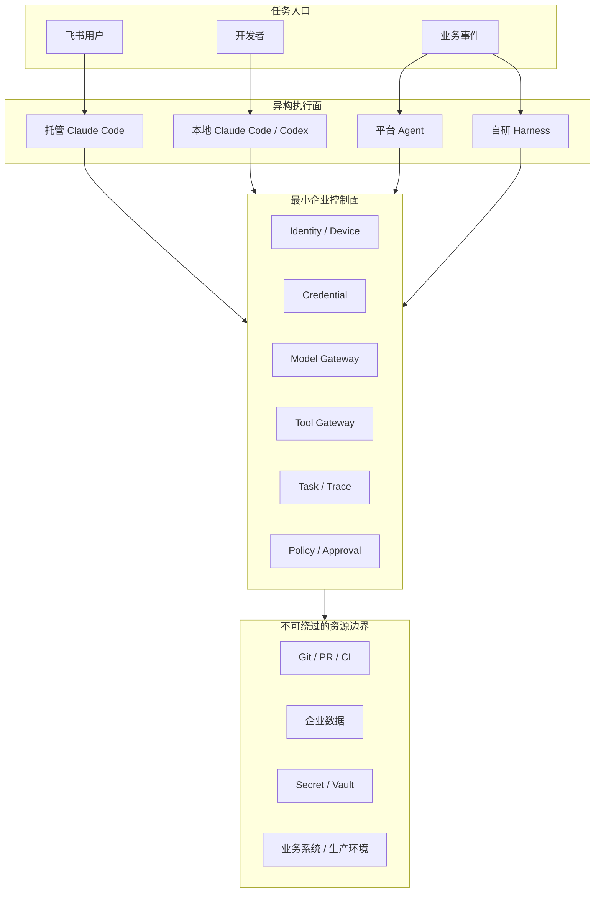

# 企业 Agent 不需要先统一：工具先行时代的最小可行治理

> **核心观点：** 企业不需要先统一 Claude Code、Codex、平台 Agent 和自研 Harness，也不需要把“AI 原生组织”设成必经终点。当前更重要的是识别能力与治理之间的缺口，用最小、不可绕过的控制点管理真实风险，并让每个自研组件都可以被删除、替换或退出。

阅读时间：约 20 分钟

关键词：Claude Code、Codex、飞书智能体、企业 Key、模型网关、Tool Gateway、双运行时、Agent 治理

---

## 一、企业 AI 的真实起点不是平台，而是工具先进入组织

理想化的企业 AI 路线通常被描述为：

```text
制定战略
→ 建设统一平台
→ 完成安全和治理
→ 开发 Agent
→ 推广给员工
```

现实往往相反：

```text
领导购买官方订阅
→ 员工开始使用 Claude Code / Codex
→ 团队部署机器、机器人和本地 CLI
→ 业务价值快速出现
→ Key、数据、权限和成本问题暴露
→ 平台与治理开始追赶
```

同一家企业中可能同时存在：

- 平台聊天和知识工具；
- 平台业务 Agent；
- 本地 Claude Code/Codex；
- 飞书接入的托管 Claude Code；
- 团队自建 Skill、MCP；
- 少量长任务 Harness；
- 未登记的个人订阅和 Shadow AI。

这种差异并不自动意味着架构失败。问题不在于 Runtime 多，而在于企业是否知道：

- 谁在使用；
- 使用了什么身份和 Key；
- 可以访问哪些数据；
- 可以调用哪些工具；
- 会造成哪些业务副作用；
- 出现风险后能否撤权、停止和追责。

因此，企业首先需要治理的不是“架构不统一”，而是“不受控制的异构”。

---

## 二、当前状态：高能力、低治理的双通道原型

当前已经形成两条事实上的执行通道。

### 2.1 托管通道

在中心机器上部署 Claude Code，通过飞书智能体向不同用户提供会话。

它的价值是：

- 用户无需安装；
- 普通业务人员也能使用；
- 企业可以统一配置 Skill 和 MCP；
- 适合长任务；
- 飞书提供身份入口和消息触达。

### 2.2 本地通道

开发本地 CLI，向员工分发企业 Key，让员工使用本地 Claude Code/Codex。

它的价值是：

- 可以访问本地代码；
- 可以使用终端、编译器和测试环境；
- 保留官方工具的交互体验；
- 避免所有代码集中上传到托管机器。

### 2.3 独立诊断

这套系统已经具备较强 Agent 能力，但还不能直接称为成熟企业平台。

更准确的描述是：

> **一个高能力、治理尚未完全跟上的双通道原型。**

能力和治理需要分开判断：

| 维度 | 当前可能位置 |
|---|---|
| 能力 | 已支持 Tool-using Agent，部分团队开始使用 Harness |
| 模型治理 | 如果请求经过企业网关，已具备基础可见性 |
| 执行治理 | 取决于托管会话是否隔离、本地设备是否可识别 |
| 副作用治理 | 取决于 MCP、业务 Token、Git 和生产权限是否收口 |
| 组织治理 | 仍处于领导推动、技术团队快速试验阶段 |

最大的风险是：

```text
Agent 能完成任务的能力
        >
企业识别、限制和审计这些任务的能力
```

这就是“能力—治理缺口”。

---

## 三、不要把 AI 原生组织当成所有企业的终点

“个人使用 → 企业工具化 → 平台化 → 去中心化 → AI 原生组织”是一种有参考价值的厂商成熟度叙事，但不是企业必须走完的路线。

很多企业的最优状态可能只是：

- 大部分员工使用标准 AI 工具；
- 研发使用本地 Coding Agent；
- 少量固定流程使用业务 Agent；
- 高风险系统保留确定性自动化和人工审批；
- 只有极少数场景使用长任务或多 Agent Harness。

银行、制造、医疗、政务等行业未必应该让整个组织变成 Agent-operated。对它们来说，AI-enabled 可能比 AI-native 更合理。

成熟度不是越高越好。正确目标是：

> 以合理成本获得业务价值，同时把数据、权限和业务风险控制在可接受范围内。

### 3.1 未来也未必完全统一

未来可能逐步收敛的是：

- 企业身份；
- Credential；
- MCP 和 Tool 协议；
- Task 与 Trace；
- Evals；
- 审批和审计接口。

可能长期保持多样化的是：

- Claude Code、Codex 等 Runtime；
- 平台 Agent；
- 自研 Harness；
- 编程语言和框架；
- 业务流程和组织分工。

所以不能把“社会准备好后会自然统一”作为企业架构前提。

更稳妥的假设是：

> 未来仍然多元，企业今天应让关键边界可替换、可接入、可撤销。

---

## 四、正确的阶段：不是 AI 能力阶段，而是治理阶段

企业真正需要关注的是：随着 Agent 权限和自主性提高，治理能力是否同步提高。

### G0：不可见试验

特征：

- 个人订阅；
- 自行安装；
- 企业不知道谁在使用；
- 没有统一 Key；
- 没有明确数据边界。

目标：获得基本可见性，而不是立即禁止。

### G1：模型访问可见

特征：

- 请求经过企业模型网关；
- 可以识别 Key；
- 可以统计模型、Token 和费用；
- 可以检查 Prompt 和响应；
- 可以设置模型白名单。

进入下一阶段的门槛：

- 每个用户或设备可独立识别；
- 厂商原始 Key 不下发；
- Key 可以独立撤销。

### G2：执行身份可归属

特征：

- 飞书用户、CLI 用户、设备和部门统一映射；
- 每个任务有 Task ID、Session ID 和 Trace ID；
- 托管会话可以归属到具体用户；
- Workspace 和进程完成基础隔离。

进入下一阶段的门槛：

> 能准确回答“谁在什么设备或 Runtime 上，为哪个业务执行了什么任务”。

### G3：业务副作用可控制

特征：

- 高风险 MCP 和业务 API 经过 Tool Gateway；
- Agent 不持有业务系统长期 Token；
- 写操作具备 Dry-run、确认和幂等；
- 代码必须经过 Git、PR 和 CI；
- 生产环境权限与模型 Key 分离。

进入下一阶段的门槛：

> Agent 即使判断错误，也不能绕过企业边界直接造成不可控后果。

### G4：运行可靠

特征：

- 任务支持超时和取消；
- 资源有配额；
- 托管运行环境可清理；
- 写操作支持重试和结果确认；
- 失败后可以恢复；
- 有事故响应和停用开关。

### G5：能力可治理

特征：

- Agent、Skill、MCP 和 Harness 有 Owner；
- 有版本和风险等级；
- 有最小 Evals；
- 有成本和使用数据；
- 可以升级、回滚和停用。

### G6：联邦式自治

特征：

- 中央团队提供身份、网关、工具和评测基础设施；
- 业务团队自行选择 Runtime；
- 低风险场景可以自助发布；
- 高风险场景进入审批；
- 业务团队对结果负责。

企业不必一定走到 G6。治理阶段应由业务价值和风险决定。

### 当前判断

如果本地 CLI 使用用户级企业网关 Key，模型侧大约处于 G1；如果飞书会话已经能够关联用户和任务，则部分进入 G2；如果业务工具和生产副作用尚未统一收口，则还没有稳定达到 G3。

---

## 五、正确目标架构：最小控制面，而不是超级平台



最小控制面包含六类能力：

1. 企业身份与设备；
2. 用户级 Credential；
3. Model Gateway；
4. MCP/Tool Gateway；
5. 最小 Task/Trace；
6. 风险策略和审批。

Registry、Skill 市场、大型 Evals 平台和统一任务编排，不应该在没有真实重复需求时全部建设。

---

## 六、企业 Key 和模型网关：重要控制点，但不是全部治理

### 6.1 必须区分 Key 类型

| Key 类型 | 模型请求可见 | 用户可归属 | 建议 |
|---|---:|---:|---|
| 厂商原始 Key | 通常不可由企业完整监控 | 弱 | 不下发 |
| 多人共享网关 Key | 可见 | 不可准确归属 | 仅短期试点 |
| 用户/设备级网关 Key | 可见 | 可归属、限额和撤销 | 当前推荐 |
| 短期、限域 Token | 可见 | 最强 | 演进目标 |

### 6.2 用户级网关 Key 已经是有效治理

成立条件：

- 厂商真实 Key 只在网关服务端；
- CLI 使用企业 `base_url`；
- 一人或一设备一个 Key；
- Key 可轮换、限额和撤销；
- 网关记录用户、部门、项目和费用；
- 网关可以检查输入和响应。

此时可以实现：

- Prompt 和响应审计；
- Secret、PII 和敏感数据检测；
- 模型白名单和路由；
- Token、成本和配额；
- 限流、阻断和熔断。

### 6.3 网关看不到的部分

- 本地文件读取；
- Shell 命令；
- 未纳管 MCP；
- 本地数据库；
- 尚未提交的代码修改；
- 个人订阅流量；
- 生产系统副作用。

所以应采用分层控制：

```text
模型输入输出 → Model Gateway
业务工具调用 → Tool Gateway
代码变更 → Git / PR / CI
Secret → Vault / Credential
生产操作 → IAM / Approval
设备与文件 → MDM / Sandbox / Dev Container
```

### 6.4 Prompt 监控本身也有风险

如果永久保存所有原始 Prompt，模型网关会成为新的敏感数据集中点。

建议：

- 默认保留元数据；
- 原始内容先脱敏；
- 低风险请求保留摘要或策略结果；
- 高风险日志设置严格访问权限；
- 设置明确保留期限；
- 对员工透明说明检测和留存规则。

---

## 七、托管 Claude Code：重点不是功能，而是多租户隔离

### 7.1 主要风险

如果多个会话共享同一个系统用户和 Home，可能出现：

- 文件跨会话读取；
- 工作目录串号；
- Git 凭证、Cookie 和 Token 泄露；
- `~/.claude`、缓存和 `/tmp` 共享；
- 进程互相影响；
- 多个任务修改同一个仓库；
- CPU、内存和磁盘争抢；
- 孤儿进程；
- 成本无法归属。

### 7.2 隔离等级

| 等级 | 隔离 | 使用范围 |
|---|---|---|
| H0 | 同一用户、目录和进程空间 | 个人实验 |
| H1 | 独立 Session 和 Workspace | 低风险试点 |
| H2 | 独立 OS User 或容器 | 企业推荐起点 |
| H3 | 临时容器/MicroVM + 动态凭证 | 高风险生产 |

### 7.3 每个任务至少独立

- Workspace；
- Git worktree；
- `HOME`；
- `TMPDIR`；
- 环境变量；
- 进程组；
- 资源配额；
- Task ID；
- Session ID；
- Trace ID；
- 生命周期与清理策略。

### 7.4 推荐生命周期

```text
飞书收到任务
→ open_id 映射企业用户
→ 创建 Task 和风险等级
→ 创建隔离 Workspace/容器
→ 注入短期模型与工具凭证
→ 启动 Claude Code
→ 回传状态
→ 高风险操作请求确认
→ 保存结果和 Artifact
→ 回收凭证并销毁环境
```

### 7.5 商业授权

如果使用个人或单席位订阅向多人提供托管服务，需要核查产品条款。技术可行不等于商业授权允许。

---

## 八、本地企业 CLI：应该是适配器，不一定要发展成平台

本地 CLI 最有价值的职责是：

- 企业身份登录；
- 配置企业模型网关；
- 获取用户/设备级 Key；
- 集成 Keychain；
- 发现企业 MCP；
- 识别项目和仓库；
- 下发安全配置；
- 上报最小 Task/Trace；
- 支持撤权和升级。

如果 CLI 只是包装官方工具，就不应该不断加入聊天、工作流、记忆和复杂编排，最终复制一个新的 Agent 平台。

### 8.1 Credential 演进

```text
共享网关 Key
→ 用户/设备级网关 Key
→ 企业身份换取短期 Token
```

### 8.2 模型权限与业务权限分离

本地 CLI 可以获得模型调用权限，但不应持有工时、财务、CRM 和生产系统长期 Token。

```text
模型 → Model Gateway
业务工具 → Tool Gateway
代码交付 → Git / CI
生产发布 → IAM / Approval
```

### 8.3 软控制不能替代强边界

AGENTS.md、CLAUDE.md、Hook 和 CLI 配置很有价值，但用户拥有本机权限时可能绕过。

不可绕过的控制应放在：

- Git 权限；
- 企业数据权限；
- Secret Vault；
- Tool Gateway；
- PR 和分支保护；
- CI/CD；
- 生产 IAM。

---

## 九、业务副作用需要独立于模型治理

企业最危险的不是模型生成错误文本，而是 Agent 获得了真实业务权限。

Tool Gateway 应负责：

- 用户身份传播；
- 工具白名单；
- 参数校验；
- Scope；
- Dry-run；
- Idempotency Key；
- 用户确认；
- 业务 Token 代理；
- 限流；
- 审计；
- 紧急停用。

代码和生产操作分别由 Git/CI 与 IAM 管理：

```text
本地 Agent 修改代码
→ Git Diff
→ Secret / License / SAST 扫描
→ 单元测试
→ PR Review
→ CI 构建
→ 才能进入生产
```

企业可以看不到 Agent 的完整思考，但必须知道它最终改变了什么。

---

## 十、工时上报 Agent：正确的固定流程架构

工时属于 L2 可逆业务写操作，适合：

> Prompt Chaining + FSM + Human-in-the-loop + 两阶段提交。

### 10.1 流程

```text
自然语言
→ 结构化解析
→ 当前用户校验
→ 项目、阶段和节点解析
→ 确定性规则校验
→ 不可变 Draft
→ Dry-run
→ 用户确认
→ 提交同一个 Draft
→ 审计和回执
```

### 10.2 LLM 负责

- 理解自然语言；
- 解析日期和工时；
- 识别项目名称；
- 发现缺失信息；
- 发起澄清；
- 生成用户摘要。

### 10.3 确定性程序负责

- 用户身份；
- 项目 ID；
- 阶段与节点关系；
- 工时规则；
- 重复检查；
- Payload；
- 幂等；
- 提交和审计。

### 10.4 双通道使用方式

- 普通员工通过飞书托管 Runtime 填报；
- 开发者通过本地 CLI 调试 Skill；
- 两条路径使用同一个 Tool Gateway；
- 工时系统 Token 不下发到本地；
- 写入确认绑定用户、Task、Draft 和 Payload Hash。

固定流程不需要 Planner、Generator、Evaluator 三个 Agent，也不需要长任务 Harness。

---

## 十一、什么时候使用平台 Agent、什么时候使用 Harness

| 场景 | 推荐方式 |
|---|---|
| 写作、翻译、摘要 | 平台 AI 工具 |
| 固定步骤生成 | Prompt Chaining |
| 工时、日程、报销 | FSM + Human-in-the-loop |
| 标准业务流程 | 平台 Agent/托管 Runtime |
| 本地编码和调试 | Claude Code/Codex |
| 多文档独立分析 | Parallelization |
| 动态复杂任务 | Orchestrator-Workers |
| 反复评分优化 | Evaluator-Optimizer |
| 长周期、多上下文 | 自研 Harness |

只有在以下条件出现时才值得自研 Harness：

- 任务运行数小时或数天；
- 需要 Context Reset；
- 需要持久化交接；
- 需要特殊沙箱；
- 需要多 Agent；
- 标准 Runtime 无法满足恢复和调度；
- 业务收益足以覆盖维护成本。

---

## 十二、现实解决路线：先降低风险，再决定做不做平台

### P0：事实确认

- 当前分发的是厂商 Key 还是企业网关 Key；
- 是否一人/一设备一个 Key；
- 托管会话是否共享 Home、Token 和缓存；
- 本地 Agent 能否直连业务 MCP；
- 哪些仓库允许个人订阅访问；
- 哪些操作可以绕过审计进入生产。

### P1：两周内止血

- 厂商原始 Key 不下发；
- 共享 Key 拆成用户/设备级网关 Key；
- 飞书用户、Task 和 Session 建立映射；
- 托管会话隔离 Workspace、Home 和进程；
- 生产 Secret 不进入本地 CLI；
- 代码强制 PR、CI 和 Secret 扫描；
- 高风险数据禁止个人订阅访问；
- 核查托管服务商业授权。

### P2：一个月内控制副作用

- 企业 MCP 白名单；
- 高风险业务工具进入 Tool Gateway；
- 工时、财务、CRM 写入要求确认和幂等；
- 托管 Runtime 增加配额、超时和停止；
- 网关日志脱敏和分级留存；
- 按用户、部门和项目统计费用。

### P3：一到三个月补最小控制面

- 企业身份和设备；
- Credential Broker；
- 短期 Token；
- Task/Session/Trace；
- Artifact 移交；
- 最小 Agent/Skill/MCP 清单；
- 高风险审批与撤权。

### P4：观察真实数据再决定平台化

| 如果反复出现 | 再建设 |
|---|---|
| 模型接入重复 | Model Gateway 产品化 |
| Key 管理困难 | Credential Broker |
| MCP 配置混乱 | Tool Registry |
| 长任务运行困难 | Hosted Runtime |
| 质量无法判断 | Evals |
| Skill 重复开发 | Skill 市场 |
| 任务无法追踪 | Task/Trace 平台 |

没有重复问题，就不要为了平台完整度而建设对应模块。

---

## 十三、企业内部比较：使用统一记分卡，而不是统一工具

Claude Code、Codex、平台 Agent 和自研 Harness 一定会被比较。应比较真实业务结果：

| 维度 | 指标 |
|---|---|
| 完成率 | 是否真正完成目标 |
| 质量 | 测试、缺陷率、返工率 |
| 速度 | 从需求到可用结果的周期 |
| 成本 | 订阅、Token、机器和维护成本 |
| 安全 | 数据泄露、越权和生产事故 |
| 可治理性 | 身份、日志、撤权和停用能力 |
| 可复用性 | Skill、工具和工件复用 |
| 用户体验 | 采用率、留存率和推荐率 |

合理结果可能是：

- 通用办公由平台工具胜出；
- 固定流程由平台 Agent 或托管 Runtime 胜出；
- 编码由本地 Claude Code/Codex 胜出；
- 特殊长任务由自研 Harness 胜出。

企业需要管理组合，而不是选一个公司级唯一冠军。

---

## 十四、组织分工：平台团队不能垄断 Runtime

### 平台团队负责

- 企业身份；
- Credential；
- Model Gateway；
- Tool Gateway；
- 最小 Task/Trace；
- 默认托管 Runtime；
- 本地 CLI 接入组件。

### 业务团队负责

- 业务问题；
- 业务指标；
- 领域 Skill；
- Runtime 选择；
- 业务验收；
- 结果和采用。

### 安全治理团队负责

- 数据分类；
- 风险等级；
- 生产权限；
- 审计策略；
- 高风险例外；
- 事故处理。

中央团队的目标不是让所有需求进入平台，而是：

> 业务可以选择任何合适 Runtime，但访问企业资源时必须遵守共同边界。

---

## 十五、不应该现在建设什么

在使用规模和重复问题尚未明确时，不建议优先建设：

- 覆盖所有场景的超级 Agent 平台；
- 复杂的多 Agent 编排中心；
- 大型 Skill 市场；
- 全量 Prompt 长期存储系统；
- 统一所有 Runtime 的抽象层；
- 没有业务评测集的通用 Evals 平台；
- 为了展示成熟度而建设的 Agent Registry；
- 重复官方 Claude Code/Codex 能力的本地客户端。

这些系统只有在真实问题反复出现时才有投资价值。

---

## 十六、需要避免的反模式

### 16.1 等平台完成再推广

工具会转入地下，企业失去观察和引导机会。

### 16.2 一台机器多会话但无隔离

聊天 Session 不等于安全租户。

### 16.3 下发厂商原始 Key

用户可以绕过网关，也难以及时回收。

### 16.4 所有人共用一个网关 Key

能看流量，但不能准确归属和单独撤权。

### 16.5 把模型网关当成完整 Agent 治理

模型网关看不到全部文件、Shell、MCP 和业务副作用。

### 16.6 把本地 Hook 当成强安全边界

用户拥有本机权限时可以绕过。

### 16.7 强迫所有场景进入一个 Runtime

会让复杂团队绕开平台，产生真正的 Shadow AI。

### 16.8 把 AI 原生当作企业 KPI

成熟度等级不是业务价值，企业不必为了到达更高阶段而增加不必要的自主性和风险。

---

## 十七、最终结论

当前最正确的策略不是继续扩大 Agent 功能，也不是立即建设完整平台，而是：

> 保留托管和本地两条执行通道，限制高风险权限扩张，优先补齐用户身份、Key 归属、托管隔离、Tool Gateway、Git/CI 和生产资源边界。

建议的升级路径：

```text
厂商 Key或共享 Key
→ 用户/设备级网关 Key
→ 短期 Credential

共享托管机器
→ Task 级 Workspace
→ 容器化隔离 Runtime

只有模型请求监控
→ 模型 + 工具 + 代码 + 生产副作用治理

两条独立通道
→ 一个最小控制面下的多个 Runtime
```

应长期坚持的原则：

1. 不把 AI 原生设为必经终点；
2. 执行面允许竞争，资源边界逐步收敛；
3. 模型权限与业务操作权限分离；
4. 本地软控制不能替代服务端强边界；
5. Agent 能力不能长期领先治理能力；
6. 可逆层快速试错，不可逆层谨慎设计；
7. 平台从真实重复中生长；
8. 每个自研组件都应可以被删除、替换或退出。

最终的成功标准不是“所有人使用同一个平台”，而是：

> 无论任务运行在飞书托管 Claude Code、本地 Claude Code/Codex、平台 Agent 还是自研 Harness，企业都能够知道是谁在执行、能访问什么、造成了什么副作用，并能在必要时撤权、停止和追责。

---

## 参考资料

### 企业 AI 成熟度与组织模型

1. [Cohere — The five phases of enterprise AI maturity, Part 1](https://cohere.com/blog/enterprise-ai-maturity-model)
2. [Cohere — The five phases of enterprise AI maturity, Part 2](https://cohere.com/blog/enterprise-ai-maturity-model-pt2)
3. [MIT Sloan — What’s your company’s AI maturity level?](https://mitsloan.mit.edu/ideas-made-to-matter/whats-your-companys-ai-maturity-level)
4. [Microsoft — 2025: The year the Frontier Firm is born](https://www.microsoft.com/en-us/worklab/work-trend-index/2025-the-year-the-frontier-firm-is-born)
5. [AWS — Generative AI operating models in enterprise organizations](https://aws.amazon.com/blogs/machine-learning/generative-ai-operating-models-in-enterprise-organizations-with-amazon-bedrock/)

### Agent 与 Harness 设计

6. [Anthropic — Building Effective AI Agents](https://www.anthropic.com/engineering/building-effective-agents)
7. [Anthropic — Effective harnesses for long-running agents](https://www.anthropic.com/engineering/effective-harnesses-for-long-running-agents)
8. [Anthropic — Harness design for long-running application development](https://www.anthropic.com/engineering/harness-design-long-running-apps)
9. [Anthropic — Demystifying evals for AI agents](https://www.anthropic.com/engineering/demystifying-evals-for-ai-agents)

