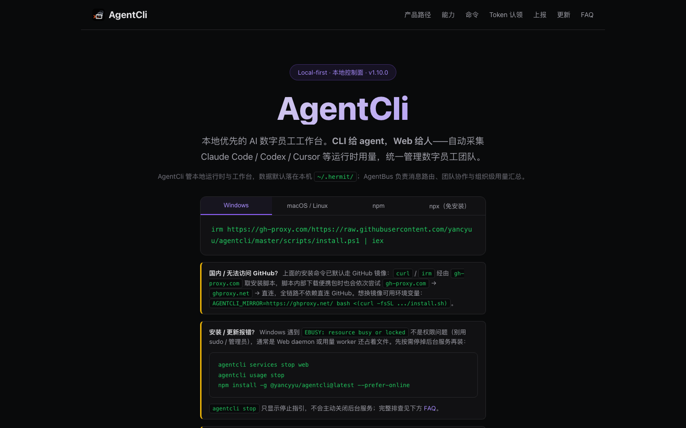
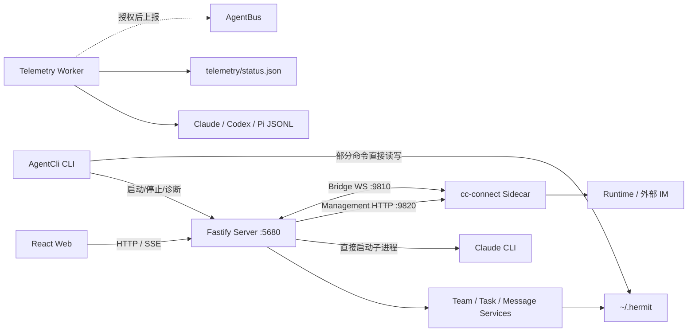

---
tags:
  - agentcli
  - ai-agent
  - architecture
  - local-first
  - technical-report
---

# AgentCli 技术架构与演进汇报

> [!abstract] 文档目的
> 本文面向技术人员，说明 AgentCli 当前解决的问题、系统边界、进程架构、核心数据流、存储模型、Runtime 适配、用量上报和现阶段技术债务。
>
> **汇报基线：GitHub Release `1.10.0`，commit `0073276`。** 本地开发工作区中的 `package.json`、README 和未提交代码可能仍存在旧版本号或实验性改动，不作为本报告的发布基线。

- 仓库：<https://github.com/yancyuu/agentcli>
- 使用文档：<https://yancyuu.github.io/agentcli/>
- 许可证：AGPL-3.0



---

## 一、系统目标与边界

AgentCli 是运行在开发者本机的 **AI Agent 工作控制面**。它不实现模型推理，也不重写 Claude Code、Codex、Pi 等 Runtime，而是在这些 Runtime 之上统一管理：

- 数字员工与项目工作目录；
- Team、Task、Message 和 Session；
- Runtime 启动、连接和状态；
- 本地 Token、消息量、会话量和工作时长；
- 可选的 AgentBus 登录、用量汇聚和企业治理。

### 非目标

- 不实现大模型推理或各家模型协议；
- 不把多租户、跨组织调度和企业审计全部放入本地进程；
- 不要求用户接入 AgentBus 才能使用本地团队、任务和用量功能。

### 系统边界

| 组件 | 当前职责 |
|---|---|
| AgentCli | Web/CLI 操作面、本地团队状态、任务、消息、会话观察、用量采集 |
| Direct CLI | 应用内会话与成员私聊，当前主要直接启动本地 Claude CLI 子进程 |
| cc-connect | Management HTTP、Bridge WebSocket、外部 IM、Runtime Project 与配置管理 |
| AgentBus | 登录授权、消息与用量汇聚、Token 池、凭证同步和企业治理 |
| Runtime 本地日志 | Claude Code、Codex、Pi 的会话与 Token 原始数据源 |

---

## 二、进程架构



### 主要进程

| 进程 | 生命周期与作用 |
|---|---|
| AgentCli CLI | 前台命令入口；部分命令直接操作本地文件，部分命令管理 Server/Worker |
| Fastify Server | 本地 Web API、SSE、团队业务、Runtime 编排和静态前端资源 |
| cc-connect | Runtime Management API、Bridge 消息和外部渠道接入 |
| Telemetry Worker | 独立于 Web 的周期扫描、聚合和远端同步进程 |
| Runtime 子进程 | Direct CLI 会话按需启动，当前主要用于 Claude Code |

### CLI 和 Web 并非完全走同一路径

- Web 固定通过 Fastify API 访问本地能力；
- `teams list/create`、`tasks list` 等 CLI 命令可以直接访问 `~/.hermit`；
- Usage CLI 既可能读取 Worker 状态文件，也可能在 Web 已运行时读取后端聚合结果；
- 因此 CLI 是独立运维入口，不只是 HTTP Client。

### CIL端：

### web端：


## 三、核心模块

| 模块 | 关键职责 | 当前实现位置 |
|---|---|---|
| Team Workspace | 团队清单、成员、任务、消息和本地目录 | `TeamWorkspaceService`、team-management services |
| Runtime Integration | cc-connect 启停、配置、Project、Session 与消息 | `hermitBridge/*`、Direct CLI services |
| Session Intelligence | 会话扫描、项目归因、Token 聚合 | `session-intelligence/*` |
| Telemetry | Worker 生命周期、状态、增量上传、凭证同步 | `src/main/telemetry/*` |
| Web API | Fastify Route、SSE、静态资源和应用编排 | `src/main/server.ts` |
| Renderer | 团队、任务、消息、设置和用量 UI | React Renderer |
| CLI | 生命周期、团队、任务、登录、用量和更新命令 | `bin/hermit.mjs`、`bin/lib/*` |

当前架构标准要求中大型功能按以下 Feature Slice 拆分：

```text
src/features/<feature>/
├── contracts/
├── core/domain/
├── core/application/
├── main/composition/
├── main/adapters/
├── main/infrastructure/
└── renderer/
```

这是**目标架构**而不是完全完成的现状。目前 `recent-projects` 是主要参考实现，Team、Runtime、Telemetry 和 Review 仍大量集中在 `server.ts`。

---

## 四、核心数据流

### 1. 创建数字员工

```text
Web 创建请求
  → Fastify 校验输入
  → 创建本地 Team Manifest
  → 绑定工作目录和 Runtime 类型
  → 创建或映射 cc-connect Project
  → 返回 Runtime Readiness
  → 可选执行飞书或 AgentBus 授权
```

创建团队和外部渠道授权被拆成两个事务，避免 OAuth、审批或网络问题阻塞本地数字员工创建。

### 2. Runtime 消息执行

系统当前存在两条执行路径：

#### Direct CLI 路径

```text
Web / Team Message
  → Fastify
  → DirectCliSessionManager
  → 本地 Claude CLI 子进程
  → 流式消息
  → SSE 返回 Web
```

适用于应用内 Loop、成员私聊和直接 Claude 会话。

#### cc-connect 路径

```text
Web / 外部 IM
  ↔ Fastify
  ↔ cc-connect Bridge WebSocket
  ↔ Runtime 或飞书等外部渠道
```

cc-connect 同时提供 Management API，用于 Project、Provider、Model 和 Session 配置。

### 3. 任务流

```text
创建任务
  → 写入 board.json
  → 分配 assignee
  → Direct CLI 或 Bridge 通知 Agent
  → Agent 更新 todo / doing / done
  → Fastify SSE 通知 Web 刷新
```

当前持久化状态只有 `todo / doing / done`。系统存在 Review UI 和兼容接口，但完整的 Git Diff 审查、接受、返工状态机尚未全部落地，不能把它描述成成熟的代码审查系统。

### 4. 会话观察

```text
Runtime 写入 JSONL
  → LocalSessionScanner / SessionUsageParser
  → 统一 Session 与 Usage 模型
  → Web / CLI 展示
  → 可选由 Worker 增量上报
```

AgentCli 不修改 Runtime Session 文件，只进行只读扫描和归一化。

---

## 五、本地数据模型

| 数据 | 默认位置 | 写入语义 |
|---|---|---|
| 团队元数据 | `~/.hermit/teams/<slug>/team.json` | 临时文件写入后 rename |
| 团队消息 | `messages/group.jsonl` | Append-only |
| 任务看板 | `tasks/board.json` | Read-modify-write 后 rename |
| 全局设置 | `~/.hermit/settings.json` | JSON 配置 |
| AgentBus 登录态 | `~/.hermit/auth/openhermit.json` | 本地授权状态 |
| Worker 状态 | `~/.hermit/telemetry/status.json` | 周期性覆盖 |
| Worker PID/锁/日志 | `~/.hermit/telemetry/`、`~/.hermit/logs/` | 进程协调与诊断 |
| cc-connect 配置 | `~/.hermit/cc-connect/config.toml` | Sidecar 配置 |
| Runtime Session | `~/.claude`、`~/.codex`、`~/.pi` | Runtime 所有，AgentCli 只读 |

### 一致性边界

- Team/Task JSON 使用临时文件加 rename，避免半文件；
- Message 使用 JSONL append，适合事件追加；
- Task 更新仍是跨进程 Read-modify-write，当前没有数据库事务或统一 CAS；
- Worker `status.json` 是覆盖写，不应视为业务事实存储；
- 上传进度以 AgentBus 服务端 Cursor 为权威，不以本地计数为权威。

---

## 六、Runtime 能力矩阵

“支持 Runtime”需要拆成配置、执行、会话解析和用量上报，不能只看菜单中是否出现名称。

| Runtime | 本地配置 | 应用内执行 | cc-connect / IM | Session 解析 | Usage 上报 |
|---|---:|---:|---:|---:|---:|
| Claude Code | 是 | Direct CLI | 是 | 是 | 是 |
| Codex | 是 | 以 cc-connect 为主 | 是 | 是 | 是 |
| Pi | Token/Provider 配置 | 当前不走 Direct CLI | 取决于 cc-connect 能力 | 是 | 是 |
| Cursor/Gemini/OpenCode 等 | 兼容注册或配置 | 否 | 取决于 cc-connect | 当前 Parser 未完整覆盖 | 否 |

### Pi 1.10.0 增量

- 扫描 `~/.pi/agent/sessions/**/*.jsonl`；
- 解析 `input/output/cacheRead/cacheWrite/totalTokens`；
- 识别 User、Assistant 和 Tool Call；
- 对 clone/fork 复制的历史 Entry 使用稳定指纹去重；
- 上传 Event ID 在不同 Session 文件中保持稳定；
- 进入 Provider、项目、日期和最近 7 天聚合。

---

## 七、用量采集与远端同步

Telemetry 不能只描述成“Token 上报”。当前实现包含三条不同敏感级别的数据流。

### 1. 本地 Usage 聚合

扫描来源：

| Provider | 路径 |
|---|---|
| Claude Code | `~/.claude/projects/**/*.jsonl` |
| Codex | `~/.codex/sessions/**/*.jsonl` |
| Pi | `~/.pi/agent/sessions/**/*.jsonl` |

本地聚合包含 Token、消息、Session、项目、日期分布和估算工作时长。执行 `usage today` 只读取本地数据，不等于网络上报。

### 2. 会话消息上报

在满足登录、Worker 运行和消息上报配置条件时，Worker 会发送：

- User/Assistant 消息正文；
- Role、Model、Provider；
- Token Usage；
- Project/Session 引用；
- Tool 名称和时间信息。

增量协议包含：

- 稳定 Event ID；
- 文件 Offset Cursor；
- 服务端 Cursor 权威；
- 批量 POST；
- Idempotency 与服务端去重；
- Upload Lock 和崩溃残留锁清理；
- 文件末尾不完整 JSONL 不推进 Cursor。

当前兼容逻辑在未显式设置 Canonical 关闭字段时可能按启用处理，因此敏感上报的默认值、首次同意和 UI 披露属于 P0 改进项。

### 3. 飞书凭证同步

Telemetry Worker 还存在独立的飞书凭证同步链路：在本机发现符合条件的 lark-cli Profile 且用户已登录 AgentBus 时，可能同步以下字段：

- `app_id` / `app_secret`；
- `access_token` / `refresh_token`；
- Profile 与身份元数据。

该链路不等同于消息正文上报，也不应复用同一个开关。技术上需要独立的授权、开关、审计状态、字段预览和撤销机制。

### 建议的隐私分级

| 能力 | 默认建议 | 用户应看到的信息 |
|---|---|---|
| 本地 Usage 聚合 | 开启 | 扫描目录和本地统计字段 |
| Token 汇总上报 | 显式开启 | Provider、项目引用、Token 指标 |
| 消息正文上报 | 默认关闭 | 正文、Tool、Model、Session 字段预览 |
| 飞书凭证同步 | 默认关闭且单独授权 | 凭证类型、目标端点、更新时间和撤销入口 |

---

## 八、技术栈与安全边界

### 技术栈

| 层级 | 技术 |
|---|---|
| Runtime | Node.js、TypeScript、ESM |
| 本地 API | Fastify 5、HTTP、SSE |
| 前端 | React 19、Vite 5、Zustand、Radix UI |
| Runtime 连接 | cc-connect Management HTTP + Bridge WebSocket |
| 构建 | pnpm、esbuild |
| 测试 | Vitest、Playwright |
| 存储 | JSON、JSONL、TOML、本地文件系统 |

### 本地安全控制

- Fastify 默认只监听 `127.0.0.1:5680`；
- Browser 请求检查 Loopback/Trusted Origin；
- Renderer 不直接访问 Node 文件系统和子进程；
- 文件编辑接口校验目标路径是否位于允许的 Workspace Root；
- Runtime Token 和授权文件应限制为当前用户可读；
- Sidecar 和 Worker 使用独立 PID、日志和配置文件。

---

## 九、部署与分发

### 发布形态

| 形态 | 内容 |
|---|---|
| npm / npx | CLI、预编译 Server/Worker、Web 静态资源、vendor 目录 |
| Standalone | 在 npm 内容基础上携带 Node Runtime，用户无需预装 Node |
| GitHub Release | Windows x64、macOS x64、macOS arm64、Linux x64 |

### 构建流程

```text
fetch vendor
  → Vite 构建 Web
  → esbuild 预编译 Server/Worker
  → 组装 npm 包
  → 组装各平台 standalone
  → Release Asset 校验
```

### 平台限制

- Standalone 自带 Node，不等于所有依赖都完全离线；
- cc-connect Vendor 当前主要预置 macOS/Windows 二进制；
- Linux 可能仍需要从镜像下载 cc-connect；
- npm 包仍将 cc-connect 保留为 Optional Dependency，并包含启动时发现与修复逻辑。

---

## 十、关键技术决策与演进

以下结论依据 2026 年 4—7 月约 400 次主线提交。

| 决策 | 原因 | 代价或后续影响 |
|---|---|---|
| Electron → Web + Fastify | 降低桌面 IPC 和原生打包耦合，浏览器工作台更易分发 | 必须强化本地 HTTP、Origin 和文件访问边界 |
| SSH/SFTP → Git 资产同步 | 团队模板和 Skills 更适合版本化同步 | 实时跨机器协调需要独立服务 |
| 引入 cc-connect Sidecar | 复用 Runtime 与外部渠道协议 | 本地同时存在 Direct CLI 和 Sidecar 两条执行路径 |
| 删除本地 Redis Task Bus | 本地客户端不应承担分布式企业控制面 | 跨团队协调移交 AgentBus |
| JSON/JSONL 本地存储 | 零依赖、透明、易备份和迁移 | 并发事务和索引能力有限 |
| 服务端 Cursor + Event ID | 支持断点续传、重试和幂等去重 | Client 与 AgentBus 协议必须保持一致 |
| 预编译 Server/Worker | 降低冷启动和运行时 TS 依赖 | 构建与版本一致性要求提高 |
| Standalone 携带 Node | 提高交付确定性 | 包体积增加 |

代表性提交：

- `52f294b`：删除 Legacy Electron Stack，围绕 cc-connect Sidecar 重建；
- `2b551e2`：建立 CLI、Telemetry Worker 和消息上传；
- `2ebeff1`：删除 Redis 和跨团队派单，收缩本地边界；
- `40816e4`：预置多平台 cc-connect 资产；
- `0073276`：加入 Pi Session、Usage 与上传支持。

---

## 十一、当前状态、风险与下一步

### 已完成

- 本地 Web 与 CLI 双入口；
- Team、Task、Message、Session 本地工作区；
- Direct CLI 与 cc-connect 双 Runtime 路径；
- Claude Code、Codex、Pi 本地 Usage Parser；
- Cursor、稳定 Event ID、批量增量上报；
- Server/Worker 预编译和四平台 Standalone Release；
- v1.10.0 Pi 聚焦测试、Typecheck 和构建在 Release Worktree 中通过。

### 主要风险

| 优先级 | 风险 |
|---|---|
| P0 | 消息正文和飞书凭证同步缺少完全独立的默认关闭、同意和审计语义 |
| P0 | Release、package.json、README 和开发工作区版本可能漂移，需要唯一版本源 |
| P1 | `server.ts` 约 7,800 行，上传服务约 2,000 行，Parser 约 1,000 行 |
| P1 | Task Board 缺少跨进程事务锁或 CAS，并发更新存在覆盖风险 |
| P1 | Review UI 与部分接口存在，但完整审查链路尚未落地 |
| P1 | Runtime “注册、配置、执行、解析、计量”能力缺少统一矩阵和契约测试 |
| P2 | Linux cc-connect 仍可能依赖网络下载 |

### 下一步建议

1. **拆分敏感数据能力**：本地统计、Token 汇总、消息正文和飞书凭证分别授权、分别开关；
2. **固定发布基线**：版本号、README、Release、npm 和 Standalone 必须来自同一 Commit；
3. **拆分核心 Feature**：优先迁移 Team、Runtime、Telemetry 和 Review；
4. **增强本地一致性**：为 Task/Config 引入文件锁、Version 或 Compare-and-swap；
5. **建立 Runtime Capability Matrix**：为每个 Runtime 定义配置、执行、会话、Usage 和渠道测试；
6. **明确 Review 产品边界**：补齐完整链路，或删除固定空响应的兼容接口；
7. **补齐 Linux 离线依赖**：预置 cc-connect 或在安装文档中明确网络前提。

---

## 十二、技术结论

AgentCli 当前已经形成了可运行的本地控制面：

```text
Web / CLI 操作面
  + 本地 Team / Task / Message 数据
  + Direct CLI / cc-connect Runtime 接入
  + Claude / Codex / Pi Session 观察
  + 可选 AgentBus 汇聚
```

其核心技术价值不是绑定某一个模型，而是把异构 Runtime 转换成统一的本地工作与观测模型。

下一阶段的重点不应继续横向增加入口，而应集中在三个方向：

1. 敏感数据边界和用户授权；
2. 本地并发一致性和进程可靠性；
3. 按 Feature Architecture Standard 拆分当前超级模块。
