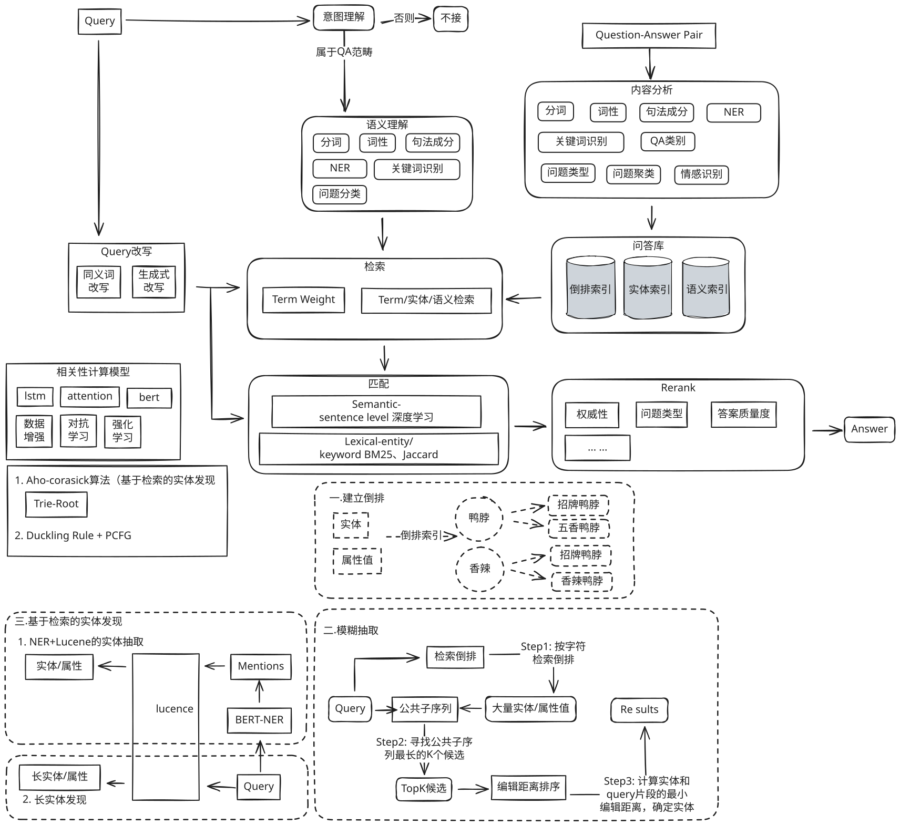

参考**传统AI智能客服应用** 结合自己的业务，并部分基于大模型进行改造，可以做出最佳实践方案。这篇文章以美团的架构为起点，结合绝味的业务进行深入的分析和改造，最终落地绝味自己的客服助手，作为企业落地的最佳范式。

对于美团来讲，平台服务的售前、售中、售后全链路的多个场景中都存在大量的咨询问题。基于问答系统，以自动智能回复或推荐回复的方式，来帮助商家提升回答用户问题的效率，同时更快地解决用户问题。
==**而绝味的问题相对于聚焦一些，虽然知识体系本身也涉及到售前，售中，售后等等，但是相对美团的多个场景，场景主要集中在店员培训比较单一。**
本文结合智能客服具体实践，以及相关论文，介绍智能客服系统整体设计、难点突破以及 端到端问答 的探索。==
 
## 1 .背景

问答系统（Question Answering System, QA）是人工智能和自然语言处理领域中一个倍受关注并具有广泛发展前景的方向，它是信息检索系统的一种高级形式，可以用准确、简洁的自然语言回答用户用自然语言提出的问题。

> [!TIP]
>**绝味在知识触达效率：知识培训，收集，审核的场景中有比较严重的痛点，一线员工流动率过快，流动率大概是百分之50，店长培训员工的效率过低，店员初期都有大量的问题需要咨询店长。因此基于问答系统，以自动智能回复或推荐回复的方式，来帮助店长提升问答效率，更快地解决店长的问题。**

针对不同问题，智能问答系统包含多路解决方案：

> [!NOTE] 
> - **PairQA**：采用信息检索技术，从社区已有回答的问题中返回与当前问题最接近的问题答案。
> - **DocQA**：基于阅读理解技术，从商家非结构化信息、用户评论中抽取出答案片段。
> - **KBQA（Knowledge-based Question Answering）**：基于知识图谱问答技术，从商家、商品的结构化信息中对答案进行推理。

在用户的问题中，包括着大量关于商品、商家、景区、酒店等相关基础信息及政策等信息咨询，基于KBQA技术能有效地利用商品、商家详情页中的信息，来解决此类信息咨询问题。

==用户输入问题后，KBQA系统基于**机器学习算法**对用户查询的问题进行 **解析** 、 **理解** ，并对知识库中的结构化信息进行查询、推理，最终**将查询到的精确答案返回给用户**。相比于PairQA和DocQA，KBQA的答案来源大多是商家数据，**可信度更高**。同时，它可以进行多跳查询、约束过滤，更好地处理线上的复杂问题。

 实际落地应用时，KBQA系统面临着多方面的挑战，
>[!NOTE]
>例如：
> - **繁多的业务场景**：绝味业务场景众多，包涵了 **产品咨询** 、 **活动咨询**、 **营运**、 **售后咨询** 等相关信息，而**不同场景中的用户意图都存在着差别**，比如 “鸭脖大概多少钱” ，对于店员需要回答对应门店的价格，而对于店长可能是想知道多个门店的价格或者是报货的价格。 
> 
> - **带约束问题**：用户的问题中通常带有众多条件，例如 “湖北有活动吗” ，**需要对湖北地区的活动进行筛选**，而不是把所有的活动都回答给用户。 
> 
> - **多跳问题**：用户的问题**涉及到知识图谱中多个节点组成的路径**，例如 “卖的最好的产品大概什么价位的” ，需要在图谱中先找到卖的最好的产品。 

下面将详细讲述美团高准确、低延时的KBQA系统的设计，处理场景、上下文语境等信息，准确理解用户、捕捉用户意图，从而应对上述的挑战。

## 2.解决方案 

 > [!NOTE]
 > - **最上层为应用层**，包括对话以及搜索等多个入口。在获取到用户Query后，KBQA线上服务**通过Query理解和召回排序模块进行结果计算**，最终返回答案文本。 
 > - **除了在线服务之外，知识图谱的构建、存储也十分重要**。用户不仅会关心商户的基本信息，也会询问观点类、设施信息类问题，比如景点好不好玩、酒店停车是否方便等。 - **针对上述无官方供给的问题，构建了一套信息与观点抽取的流程**，**可以从商家非结构化介绍以及UGC评论中抽取出有价值的信息**，从而提升用户咨询的满意度，在下文进行详细介绍。

### KBQA系统架构图
- 应用场景：查询、召回、理解、排序
- 知识存储：Hive
- 自动化图谐构致
- 知识平台：离线挖掘
- 数据来源：
  - 全领域POI
  - 商品/菜品
  - UGC
  - 外部数据
---

### KBQA 传统解决方案
#### 问题定义
Query → System → Answer → KB

#### 业界方案分类
1. **Semantic Parsing-based（基于语义解析）**
   - 主思想：对问句进行深度句法解析，将解析结果组合成可执行的逻辑表达式（如 SparQL），直接从图数据库中查询答案。
   - 优点：可解释性强
   - 缺点：需大量标注自然语言逻辑表达式

2. **Information Retrieval-based（基于信息抽取）**
   - 主思想：解析问句主实体 → 从 KG 中查询关联三元组 → 构建子图路径（多跳子图）→ 对问句和子图编码排序 → 返回最高分路径作为答案
   - 优点：端到端，适合复杂问题、少样本
   - 缺点：子图过大时计算速度显著下降

---

我们可以看到，传统方案十分复杂：
1. ==Query理解:输入原始Query，输出Query理解结果。其中会对对Query进行句法分析识别出用户查询的主实体是“故宫”、业务领域为“旅游”、问题类型为一跳(One-hop)。==
2. ==关系识别:输入Query、领域、句法解析结果、候选关系，输出每个候选的分数。在这个模块中，我们借助依存分析强化Query的问题主干，召回旅游领域的相关关系，进行匹配排序，识别出Query中的关系为“门票”。==
3. ==子图召回:输入前两个模块中解析的主实体和关系，输出图谱中的子图(多个三元组)e对于上述例子，会召回旅游业务数据下主实体为“故宫”、关系为“门票”的所有子图==
4. ==答案排序:输入Query和子图候选，输出子图候选的分数，如果Top1满足一定阈值，则输锗团记牦羑员項鴐輿体出作为答案。基于句法分析结果，识别出约束条件为“学生票”，基于此条件最终对Query-Answer对进行排序，输出满足的答案。==

### 用大模型完全重构
**上面整套「规则+图谱+子图召回」的 KBQA 流水线，在今天十亿级大模型面前已经显得过于笨重**。  
下面用一张「传统 vs. 大模型」对照表，让你一眼看到哪些环节正在被「大模型原生」取代，哪些还能保留做「安全护栏」。

| 传统 KBQA 环节    | 传统做法           | 大模型时代新做法                                           | 是否还需要旧模块          |
| :------------ | :------------- | :------------------------------------------------- | :---------------- |
| **Query 理解**  | 序列标注+依存分析+领域分类 | 一句话丢给大模型，直接输出结构化 JSON（实体、关系、约束）                    | ⛔ 可淘汰，留 Prompt 即可 |
| **实体链接**      | 词典+字符串相似度+人工规则 | 让 LLM 在候选列表里做「指代消歧」，或用 Embedding 向量召回+LLM 重排       | ⚠️ 轻量召回仍需，规则层可丢   |
| **关系识别**      | 依存强化+候选关系打分    | Prompt 里直接让 LLM 输出「关系名」或「自然语言转 SparQL」             | ⛔ 可淘汰             |
| **子图召回**      | 图谱多跳查询剪枝       | ① 让 LLM 直接生成可执行 SparQL；   ② 甚至不用图谱，靠参数化记忆回答     | ⛔ 可淘汰（若不用图谱）      |
| **答案排序/约束校验** | 人工特征+规则阈值      | LLM 自回归生成答案时，自带约束检查；或用「反思」Prompt 自检                | ⛔ 可淘汰             |
| **知识来源**      | 必须提前建好千万级三元组   | ① 大模型参数里已「记忆」公开事实；   ② 私域知识用 RAG：向量库实时检索+LLM 生成 | ⚠️ 私域仍需向量库，但无需三元组 |
| **可解释性**      | 每一步可查日志        | 用「Chain-of-Thought + 引用溯源」：让 LLM 生成答案时同时给出引用段落     | ✅ 新方案同样可解释        |

### 目前落地的最佳范式（成本性能综合最优）

1. **公开领域（百科、生活常识）**：直接 **Prompt + LLM** 即可，准确率 90%+，**图谱整条链路可下线**。
    
2. **私域/实时数据（商家库存、房价、优惠）**：  
    **RAG > 图谱**——向量库存最新文档，LLM 实时阅读理解，**无需提前构三元组**。
    
3. **超高精度场景（金融合规、医疗）**：  
    可以用 **LLM + 图谱混合**：LLM 负责「理解→生成 SparQL」，图谱只做「执行与校验」，**把 20 吨重的 pipeline 压缩成 1 个 Prompt + 1 次查询**。
    
### 别再从 0 到 1 搭「实体-关系-子图」重型战车了；

**除非你的场景对「100% 可解释 + 毫米级误差」强刚需，否则 LLM+RAG 就是新一代 KBQA 的终极形态。**

## 3. 基于RAG的解决方案：

- 可参考具体技术细节：
1. [[2025-0105 📚 RAG技术进化路线]]
2. [[2025-0919 🤖 RAG 设计模式]]

大模型可以将很多传统模块优化掉，而我们最重要的工作变成了，知识的收集，知识的管理，已经如何做RAG让其合理高效准备的被LLM使用，当然LLM+RAG不是万能的，幻觉无法被完全避免。在做RAG之前，需要整个团队思考清楚以下几个问题：

> [!WARNING] 解析格式的复杂性
> 文档格式多样化种类多样化，内部数据复杂，且都是绝大部分是非结构化文档，如何理？2. 如何实现图文回复，提高图文召回率，且召回图片尽可能不错？
> 
> 有的文档太长（5w—10w），模型对超长文本理解，随文本长度正向衰减，文档切割如何保证分块内容，语义，上下文的完整性？
> 
> 实际场景中，我们自己都割不好更何兄用戸，用戸不可能手动切割，能不能自动化切割？还能保证分块达到如上要求
> 用户提问随意，主要集中在一下方面，如何解决解决优化？
	全局问题（详细介绍下xx产品）
	局部问题:（去北京出差，我的衣食住行相关标准是了，加班超过几点算调休？）
	推理问题:（A产品和B产品差异性在哪？）
	复杂多跳问题：（一个提问包含多个子问题）
	
> [!WARNING] 意图的复杂性
> 要不要进行意图识别，如何确定意图数量，意图识别何实现，单论意图判定不准，无法判定用户真实意图，如何优化？
> 
> 如何准确的搜索召回到想要的数据？
> 
> 如何实现“边搜索，边思考”，LLM自适应调整执行计划？
> 
> 如何做好用户交互，用户体验（数据解析处理阶段，检索回答响应阶段，事后补救阶段）

> [!WARNING] 过滤维度的复杂性
> 
> 如何做好LLM上下文工程（数据处理阶段去除文本噪声（缩短文本token），召回阶段（确保相关数据内容召回），上下文压缩，Agent对话隔离）
> 
> 文档级权限控制如何实现

可以得到一个结论，好的Rag是增强现在已经有的知识，首先你得有知识，而非单纯技术实现。
所以很多人觉得RAG就是知识库，其实并不是，rag只是一种技术手段，而知识库本身除了rag模块外，还应该包含，权限管理，文档解析，文档切片分段，文档索引，文档检索等模块。

> [!note] 是否有必要强定制
很多AgentOps平台或者编排框架都内置了常用的文档解析的模块，比如ragflow的deepdoc，langchain的文档加载器（Document Loaders）和解析工具（Parsers），dify，fastgpt平台上的解析索引功能。
大部分是够用的，但是对于企业来说，可能更重要的是数据权限问题，就是不同人看到的知识甚至使用的检索工具权限应该是不一样的，而市面上的框架和平台大多是通用能力，作为企业并不能完全满足需求。

如果你连知识管理都没做，那就别考虑做Agent了，巧妇难为无米之炊，目前对于企业级知识库，主要有三种方案可以让你打造出自己的企业客服。
1. 找知识管理做的细的平台共创，比如飞书，飞书的知识做的颗粒度非常细。缺点就是贵，可能不太适合做特别定制化的能力。
2. 要么找个靠谱的二开，比如ragflow，已经内置很多种业务模板。
3. 还有一种方案，就是自己做，如果人力够有资源有决心的话，这里要注意的是：因为你自己企业的知识库大概率融合了很多企业自身的业务和流程，无法标准化作为sass提供给第三方使用，所以要控制预期。

==为了获得速度+准确度的平衡需要多种实现方式混合。以下是我们的最佳实践，大家可以结合具体业务进行改造。最重要的是打造出自己的意图泛化库+工具抽象API+业务知识库。==
![[../../📚RAG/excalid/客服类Rag流程图.svg]]