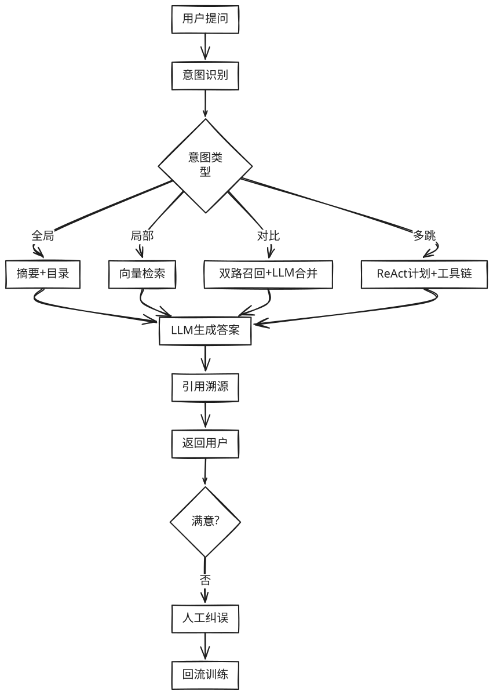

参考**传统AI智能客服应用** 结合自己的业务，并部分基于大模型进行改造，可以做出最佳实践方案。这篇文章以美团的架构为起点，结合绝味的业务进行深入的分析和改造，最终落地绝味自己的客服助手，作为企业落地的最佳范式。

Lucene：是一个高效的、开源的全文搜索库，广泛用于实现搜索引擎功能。它是由 Apache 软件基金会开发和维护的，用于在应用程序中提供文本搜索功能。
对于美团来讲，平台服务的售前、售中、售后全链路的多个场景中都存在大量的咨询问题。基于问答系统，以自动智能回复或推荐回复的方式，来帮助商家提升回答用户问题的效率，同时更快地解决用户问题。

Semantic - Sentence Level 深度学习：这种方法通常使用神经网络和深度学习模型，如BERT、GPT、Transformer，来对句子的语义进行编码和比较。这些模型能够学习到词语、短语和整个句子的深层次语义信息。

Lexical - Entity/Keyword BM25、Jaccard：这个方法着重于文本的表面形式，比如词汇、实体（如人名、地点、组织）或关键词的匹配。它通常用于检索任务中，用来判断文档之间的相关性。

对于美团来讲，平台服务的售前、售中、售后全链路的多个场景中都存在大量的咨询问题。基于问答系统，以自动智能回复或推荐回复的方式，来帮助商家提升回答用户问题的效率，同时更快地解决用户问题。

==**而绝味的问题相对于聚焦一些，虽然知识体系本身也涉及到售前，售中，售后等等，但是相对美团的多个场景，场景主要集中在店员培训比较单一。**
本文结合智能客服具体实践，以及相关论文，介绍智能客服系统整体设计、难点突破以及 端到端问答 的探索。==
 
## 1 .背景

问答系统（Question Answering System, QA）是人工智能和自然语言处理领域中一个倍受关注并具有广泛发展前景的方向，它是信息检索系统的一种高级形式，可以用准确、简洁的自然语言回答用户用自然语言提出的问题。

> [!TIP]
>**绝味在知识触达效率：知识培训，收集，审核的场景中有比较严重的痛点，一线员工流动率过快，流动率大概是百分之50，店长培训员工的效率过低，店员初期都有大量的问题需要咨询店长。因此基于问答系统，以自动智能回复或推荐回复的方式，来帮助店长提升问答效率，更快地解决店长的问题。**

针对不同问题，智能问答系统包含多路解决方案：

> [!NOTE] 
> - **PairQA**：采用信息检索技术，从社区已有回答的问题中返回与当前问题最接近的问题答案。
> - **DocQA**：基于阅读理解技术，从商家非结构化信息、用户评论中抽取出答案片段。
> - **KBQA（Knowledge-based Question Answering）**：基于知识图谱问答技术，从商家、商品的结构化信息中对答案进行推理。

在用户的问题中，包括着大量关于商品、商家、景区、酒店等相关基础信息及政策等信息咨询，基于KBQA技术能有效地利用商品、商家详情页中的信息，来解决此类信息咨询问题。

==用户输入问题后，KBQA系统基于**机器学习算法**对用户查询的问题进行 **解析** 、 **理解** ，并对知识库中的结构化信息进行查询、推理，最终**将查询到的精确答案返回给用户**。相比于PairQA和DocQA，KBQA的答案来源大多是商家数据，**可信度更高**。同时，它可以进行多跳查询、约束过滤，更好地处理线上的复杂问题。

 实际落地应用时，KBQA系统面临着多方面的挑战，
>[!NOTE]
>例如：
> - **繁多的业务场景**：绝味业务场景众多，包涵了 **产品咨询** 、 **活动咨询**、 **营运**、 **售后咨询** 等相关信息，而**不同场景中的用户意图都存在着差别**，比如 “鸭脖大概多少钱” ，对于店员需要回答对应门店的价格，而对于店长可能是想知道多个门店的价格或者是报货的价格。 
> 
> - **带约束问题**：用户的问题中通常带有众多条件，例如 “湖北有活动吗” ，**需要对湖北地区的活动进行筛选**，而不是把所有的活动都回答给用户。 
> 
> - **多跳问题**：用户的问题**涉及到知识图谱中多个节点组成的路径**，例如 “卖的最好的产品大概什么价位的” ，需要在图谱中先找到卖的最好的产品。 

下面将详细讲述美团高准确、低延时的KBQA系统的设计，处理场景、上下文语境等信息，准确理解用户、捕捉用户意图，从而应对上述的挑战。

## 2.基于KBQA的解决方案 

 > [!NOTE]
 > - **最上层为应用层**，包括对话以及搜索等多个入口。在获取到用户Query后，KBQA线上服务**通过Query理解和召回排序模块进行结果计算**，最终返回答案文本。 
 > - **除了在线服务之外，知识图谱的构建、存储也十分重要**。用户不仅会关心商户的基本信息，也会询问观点类、设施信息类问题，比如景点好不好玩、酒店停车是否方便等。 
 > - **针对上述无官方供给的问题，构建了一套信息与观点抽取的流程**，**可以从商家非结构化介绍以及UGC评论中抽取出有价值的信息**。

### KBQA系统架构图
- 应用场景：查询、召回、理解、排序
- 知识存储：Hive
- 自动化图谐构致
- 知识平台：离线挖掘
- 数据来源：
  - 全领域POI
  - 商品/菜品
  - UGC
  - 外部数据
---

### KBQA 传统解决方案
#### 问题定义
Query → System → Answer → KB

#### 业界方案分类
1. **Semantic Parsing-based（基于语义解析）**
   - 主思想：对问句进行深度句法解析，将解析结果组合成可执行的逻辑表达式（如 SparQL），直接从图数据库中查询答案。
   - 优点：可解释性强
   - 缺点：需大量标注自然语言逻辑表达式

2. **Information Retrieval-based（基于信息抽取）**
   - 主思想：解析问句主实体 → 从 KG 中查询关联三元组 → 构建子图路径（多跳子图）→ 对问句和子图编码排序 → 返回最高分路径作为答案
   - 优点：端到端，适合复杂问题、少样本
   - 缺点：子图过大时计算速度显著下降

---

>[!warning]
传统 KBQA 要先后做**句法分析→实体识别→领域分类→依存强化→关系召回→子图剪枝→约束排序**七步连环操作，才能把"绝味鸭脖相关的活动"这几个字翻译成答案；而 LLM 时代，一句 Prompt 就完事。

### 用大模型完全重构
**上面整套「规则+图谱+子图召回」的 KBQA 流水线，在今天十亿级大模型面前已经显得过于笨重**。  
下面用一张「传统 vs. 大模型」对照表，让你一眼看到哪些环节正在被「大模型原生」取代，哪些还能保留做「安全护栏」。

| 传统 KBQA 环节    | 传统做法           | 大模型时代新做法                                           | 是否还需要旧模块          |
| :------------ | :------------- | :------------------------------------------------- | :---------------- |
| **Query 理解**  | 序列标注+依存分析+领域分类 | 一句话丢给大模型，直接输出结构化 JSON（实体、关系、约束）                    | ⛔ 可淘汰，留 Prompt 即可 |
| **实体链接**      | 词典+字符串相似度+人工规则 | 让 LLM 在候选列表里做「指代消歧」，或用 Embedding 向量召回+LLM 重排       | ⚠️ 轻量召回仍需，规则层可丢   |
| **关系识别**      | 依存强化+候选关系打分    | Prompt 里直接让 LLM 输出「关系名」或「自然语言转 SparQL」             | ⛔ 可淘汰             |
| **子图召回**      | 图谱多跳查询剪枝       | ① 让 LLM 直接生成可执行 SparQL；   ② 甚至不用图谱，靠参数化记忆回答     | ⛔ 可淘汰（若不用图谱）      |
| **答案排序/约束校验** | 人工特征+规则阈值      | LLM 自回归生成答案时，自带约束检查；或用「反思」Prompt 自检                | ⛔ 可淘汰             |
| **知识来源**      | 必须提前建好千万级三元组   | ① 大模型参数里已「记忆」公开事实；   ② 私域知识用 RAG：向量库实时检索+LLM 生成 | ⚠️ 私域仍需向量库，但无需三元组 |
| **可解释性**      | 每一步可查日志        | 用「Chain-of-Thought + 引用溯源」：让 LLM 生成答案时同时给出引用段落     | ✅ 新方案同样可解释        |

### 目前落地的最佳范式（成本性能综合最优）

1. **公开领域（百科、生活常识）**：直接 **Prompt + LLM** 即可，准确率 90%+，**图谱整条链路可下线**。
    
2. **私域/实时数据（商家库存、房价、优惠）**：  
    **RAG > 图谱**——向量库存最新文档，LLM 实时阅读理解，**无需提前构三元组**。
    
3. **超高精度场景（金融合规、医疗）**：  
    可以用 **LLM + 图谱混合**：LLM 负责「理解→生成 SparQL」，图谱只做「执行与校验」，**把 20 吨重的 pipeline 压缩成 1 个 Prompt + 1 次查询**。
    
### 别再从 0 到 1 搭「实体-关系-子图」重型战车了；

**除非你的场景对「100% 可解释 + 毫米级误差」强刚需，否则 LLM+RAG 就是新一代 KBQA 的终极形态。**

## 3. 基于RAG的解决方案：

- 可参考具体技术细节：
1. [2025-0105 📚RAG技术进化路线](2025-0105%20📚RAG技术进化路线)
2. [2025-0919 🤖RAG 设计模式](../../2025-0919%20🤖RAG%20设计模式.md)

> 前文我们用"规则+图谱"堆出的重型 KBQA，在公开领域已被大模型降维打击；但在**私域、多格式、长文本、强权限**的企业场景里，**"有知识"比"有模型"更重要**。  
> 下面把我们两年里沉淀的"企业级 RAG 最佳实践"完整摊开，方便直接贴在传统方案后面，作为"下一代知识库"建设指南。

![[../../📚RAG/excalid/客服类Rag流程图.svg]]

### 1. 先澄清一个误区：RAG ≠ 知识库

RAG 只是**「检索增强生成」**这一道技术工序；  
**企业知识库**= 权限中心 + 文档中心 + 解析中心 + 索引中心 + RAG 中心 + 运营中心，缺一块都跑不通。

### 2. 三种落地路径（预算 & 人力对照表）

|路径|适合|优点|缺点|备注|
|:--|:--|:--|:--|:--|
|① 与成熟平台共创   （飞书、Microsoft Syntex）|预算足、求快、标准 SaaS 能接受|权限颗粒度细、上线快|贵、难定制、数据出境风险|飞书多维表格+知识库+审批流，可直接当"权限中台"|
|② 开源二开   （RAGFlow、Dify、FastGPT）|有 2-3 人技术小队|有 DeepDoc、OCR、表格识别、模板市场|权限模型弱、分布式场景需自补|RAGFlow 的"业务模板"能省 60% 开发量|
|③ 全自研|老板铁了心、研发>10 人|完全贴合内部流程、可商业化|周期长、需养团队|建议只自研"权限+解析+图谱"内核，其余用开源组件|

### 3. 自研项目立项目的

1. 解决知识"**散**（散落网盘/钉钉/邮件）**乱**（版本混乱）**失**（人员离职即消失）"
2. 让销售/研发/客服**少翻 80% 文档**，平均每人每天省 30 min 检索时间
3. 为后续**合同审查、销售陪练、智能客服、AI 质检**提供统一数据底座，避免"一个场景建一个库"

### 4. 12 个核心问题 → 我们的最佳实践
| 序号  | 痛点          | 3 天速效方案                                      | 3 月长期方案                                    | 踩坑提示                          |
| --- | ----------- | -------------------------------------------- | ------------------------------------------ | ----------------------------- |
| 1   | 文档格式杂、非结构化  | RAGFlow / Dify 内置 DeepDoc 一键解析 PDF/扫描件/Excel | 自研版式识别 + 版面对比，解决"修订版只改一行"                  | 表格千万别转 Markdown，会丢合并单元格       |
| 2   | 图文混排召回      | 图片 OCR 成文本后走向量；流程图用 LayoutLMv3 图编码           | 训练图文双塔模型（ViT+BERT），图文一次召回                  | 别把图片 base64 直接扔向量库，512 维就炸    |
| 3   | 5-10 万字超长文档 | 按"章节标题+层级号"预切 → 滑动 512 字重叠 20%               | Small2Big 二级索引：段落向量 → 段落 ID → 原始页码         | 切太碎会丢章标题语境，务必把标题拼到 chunk 前    |
| 4   | 自动化语义切分     | PyPDF2+正则抽章节号 → BIES 标注+CRF 模型切              | LLM 切分器：Prompt 让大模型按"主题漂移点"切               | CRF 训练集>200 篇才稳定，少样本直接用 LLM 切 |
| 5   | 用户提问随意      | 建意图泛化库 + 反问模板                                | Self-Ask 模式：LLM 先拆子问题 → 分别召回               | 全局问题别直接出答案，先给摘要+出处            |
| 6   | 意图识别        | 定 10 个高频意图，用 Sentence-BERT 微调二分类             | 动态意图：让 LLM 读文档目录自动生成意图                     | 单意图不准就改多标签+阈值                 |
| 7   | 搜索召回准度      | 混合检索：Dense（bge-large）+ Sparse（BM25）+ 标题权重×2  | 加 Cross-Encoder 重排（monoT5），Top10 重排命中率+18% | 别迷信向量，BM25 对数字/型号效果反而好        |
| 8   | 边搜索边思考      | ReAct 模板：LLM 调用 Search／Lookup／Finish 三工具     | Plan-and-Execute：先出完整搜索计划 → 再执行            | 搜索日志回写给模型，下次自动纠偏              |
| 9   | 用户交互体验      | 解析阶段给进度条（10%/30%/100%）；回答阶段流式 SSE            | 事后 thumbs up/down + 人工纠误入口，数据回流训练          | 一定给"来源页码"按钮，减少幻觉投诉            |
| 10  | 上下文工程       | 噪声清洗：LLM 删页眉页脚 → token 压缩（Chinese-Bart 摘要）   | 对话隔离：每轮只带最近 2 轮 + 本次召回 Top3                | 摘要模型别用通用新闻，用自己的文档微调           |
| 11  | 要不要知识图谱     | 短期不需要；私域实体<5 万直接向量召回                         | 多跳+数字型问题>30% 时，上 LLM→SparQL 混合方案           | 图谱只做校验与溯源，不再做召回               |
| 12  | 文档级权限       | 权限标签（部门+角色+密级）当额外向量维度存 Milvus，查询时过滤          | 自研 ABAC 引擎：(用户属性 × 文档属性) 动态判权              | 别把权限写业务代码，集中成 SDK             |
> 全部在生产环境跑通，按"**T+3 天可上线**→**T+3 月可打磨**"分层给出。

---

### 5. 意图泛化库 + 工具抽象 API + 业务知识库

1. **意图泛化库**（离线自动生成）
    - 输入：文档目录 + 历史问答对
    - 输出：意图名称、同义问法 50+、对应 SQL/向量过滤条件
    - 工具：用 LLM 批量生成→人工抽检→入库
        
2. **工具抽象 API**（统一 Swagger）
    
    - `search_docs(query, top_k, filters)`
    - `lookup_page(doc_id, page)`
    - `execute_sql(sql)`
    - 让任何 Agent（ReAct、LangChain、Dify）**零改造**接入
        
3. **业务知识库**（持续运营）
    
    - 每周**自动 diff** 新增文档→触发**增量解析+向量更新**
    - 每月**人工复核** Top 100 bad case→反哺意图库 & 切分模型

