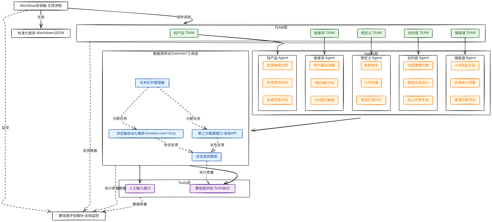
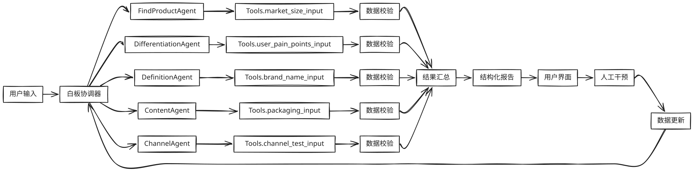

## 系统概述

此产品旨在帮助产品团队快速识别和评估新产品的市场机会。系统采用多智能体架构，将产品机会评估分解为多个步骤（TEAM），每个步骤由专门的Agent组成，Agent调用特定的Tools完成子任务。**每个TEAM负责一个特定的研究步骤，对各Agent的输出进行整合、置信度评估、加权打分，并按统一模板生成结构化报告，最后通过Workflow去执行多个步骤，并得出综合性报告**。系统的核心价值在于通过AI自动化分析降低市场研究的时间成本，同时通过置信度评估机制确保分析结果的可靠性。



## 产品目标

1. **结构化智能输出**：
    - 生成**标准化JSON报告**，包含分析结果、置信度评分和原始数据引用
    - 支持**Markdown格式**的可视化商业报告，含关键图表与执行建议
    - 输出**可执行策略包**（含命名库、口号集、渠道匹配方案等）
2. **动态权重优化**：
    - 根据品类特性自动调整"市场空间×竞争格局×自身优势"三大维度权重
    - 基于实时市场数据动态校准评估参数（如：政策变化对进入壁垒的影响）
    - 通过A/B测品结果反馈优化评分模型
3. **多品类TEAM协作框架**：
    - **找产品TEAM**：系统评估品类是否构成"真机会"
    - **做差异TEAM**：基于"9新+9切"构建强感知差异化
    - **想定义TEAM**：系统化构建价值传递体系（命名/口号/卖点结构）
    - **创内容TEAM**：生成线上线下一体化内容体系
    - **铺渠道TEAM**：通过小成本测品锁定高潜力原点市场
    - 通过**Workflow协调器**实现TEAM间有序协作，确保战略不打折、信息无折损
4. **人机协同演进**：
    - 当前阶段：关键决策点保留人工审核接口
    - 中期演进：基于历史决策数据训练专用模型
    - 长期目标：形成闭环学习系统，自动优化评估参数与策略建议
    
5. **全流程自动化**：将传统需要数周完成的市场机会评估工作缩短至数小时，通过**异步浏览器自动化集群**和**多源数据接口**实现从数据采集到策略生成的端到端自动化流程
    
6. **分层置信度评估**：
    - **数据层**：评估采集源可靠性（平台权威性、数据新鲜度）
    - **分析层**：评估逻辑一致性（多维度数据交叉验证）
    - **决策层**：评估战略匹配度（与企业基因契合度）
    - 为每个TEAM输出提供0-10分置信度评分，帮助用户判断结果可靠性

## 用户场景

**主要用户群体**：
- 产品经理及市场研究人员
- 创业团队及新业务线负责人
- 企业战略部门
- 投资机构及行业分析师

**典型使用场景**：
- 评估新产品进入市场的可行性
- 分析现有产品的市场机会
- 制定产品差异化策略
- 优化产品定位和内容创作
- 设计产品推广渠道策略

### 系统架构

#### 1. 整体架构

系统采用分层架构，包括：
- **用户界面层**：提供参数输入界面和报告查看界面
- **Workflow调器层**：按顺序调用各个TEAM，收集结果，计算整体置信度
- **TEAM层**：负责每个步骤的研究和评估
- **Agent层**：执行每个步骤中的子任务并使用模型分析
- **Tools层**：提供原子操作功能，如数据抓取、数据输入

#### 2. 交互流程

```
+------------------+
|   用户请求输入    |
| (品类名称等参数)  |
+------------------+
          ↓
+------------------+
|  找产品 TEAM     | ←── 统筹市场空间分析、竞争格局分析、自身优势评估Agent
+------------------+
          ↓
+------------------+
|  做差异 Team     | ←── 统筹用户痛点挖掘和差异点生成Agent
+------------------+
          ↓
+------------------+
|  想定义 Team     | ←── 统筹产品定义Agent
+------------------+
          ↓
+------------------+
|  创内容 Team     | ←── 统筹内容生成Agent
+------------------+
          ↓
+------------------+
|  铺渠道 Team     | ←── 统筹渠道策略Agent
+------------------+
          ↓
+-----------------------------+
|   白板协调器（主控流程）     |
|   → 按顺序调用上述5个TEAM    |
|   → 收集各TEAM结构化输出     |
|   → 计算整体置信度           |
|   → 按统一报告模板组装最终输出 |
+-----------------------------+
          ↓
+------------------+
|  最终报告输出     |
| （Markdown/JSON） |
+------------------+
```

### 需求分析

#### 1. 用户需求

**核心需求**：
- 快速获取市场机会评估结果
- 了解评估结果的可靠性（置信度）
- 获得差异化的市场进入策略
- 支持多品类的市场机会评估
- 生成结构化报告，便于后续决策

**扩展需求**：
- 支持自定义权重调整
- 提供可视化分析结果
- 支持多语言报告生成
- 提供数据来源的透明度说明
- 支持历史报告的版本管理

#### 2. 功能需求

**基础功能**：
- 品类参数输入
- 自动化市场机会评估
- 人工干预与修正
- 结构化报告输出
- 自定义权重配置
- 报告版本管理


**高级功能**：
- 置信度评估机制
- 历史报告对比分析
- 多维度数据可视化
- 品类通用适配能力

## 技术架构

#### 1. 技术选型

| 技术领域  | 选型                     | 说明               |
| ----- | ---------------------- | ---------------- |
| 大语言模型 | 千问/GPT/Gemini          | 提供核心推理能力         |
| 流程控制  | Python asyncio、aiohttp | 实现异步非阻塞流程控制      |
| 数据分析  | 统计模型、层次分析法             | 支持市场趋势预测和加权打分    |
| 前端框架  | React、Vue.js           | 提供用户界面           |
| 后端框架  | FastAPI、Agno           | 构建系统API          |
| 数据存储  | pgsql、Redis            | 存储用户数据、历史报告和模型结果 |

#### 2. 置信度评估算法

系统采用多维度置信度评估算法，为每个步骤提供置信度评分：

**置信度计算公式**：
```
置信度 = (数据来源权重 × 数据可信度) + (模型权重 × 一致性分) - (人工干预权重 × 修正次数)
```

**参数说明**：
- **数据可信度**：根据数据来源的权威性评分（如国家统计局=1.0，人工输入=1，考古家=0.8）
- **一致性分**：计算多模型/多Tools输出结果的误差（如均方根误差RMSE），一致性分=1/(1+RMSE)
- **修正次数**：用户手动调整的次数，每次调整减0.05
- **权重分配**：数据权重0.4，模型权重0.4，人工干预权重0.2

#### 3. 加权打分模型

系统采用动态权重调整的加权打分模型，为每个步骤提供综合评分：

**综合得分计算公式**：
```
composite_score = Σ (agent_score × adjusted_weight)
```

**参数说明**：
- **adjusted_weight**：动态调整后的权重，根据置信度高低调整
- **agent_score**：每个Agent的评分

**静态权重分配**（可配置）：
- 市场空间分析Agent：40%
- 竞争格局分析Agent：30%
- 自身优势评估Agent：30%

**动态权重调整**：
- 若子任务置信度<0.7，则其权重降低至原值的50%
- 若子任务置信度>0.9，则其权重提高至原值的120%

## 团队架构设计

### 1. 找产品 TEAM

#### 职责

系统评估品类是否构成“真机会”，聚焦三大维度：**市场空间、竞争格局、自身优势**，为大单品选品提供数据驱动的决策依据。核心目标是识别具备高增长潜力、低进入壁垒且与企业基因高度匹配的品类赛道。

#### TEAM 构成与子Agent职责

- **竞争格局分析 Agent**
    
    - `collect_competitor_data`：采集品类内头部及主要竞争对手的品牌表现、市场份额与产品策略
    - `collect_competition_intensity_data`：评估市场竞争激烈程度（如价格战频率、新品迭代速度、渠道重合度）
    - `collect_entry_barrier_data`：识别进入壁垒（包括渠道封锁、专利门槛、供应链集中度、头部品牌封杀历史等）
- **市场空间分析 Agent**
    
    - `collect_market_space_data`：整合外部权威数据源（券商研报、行业数据库、平台指数等），量化品类整体规模、年复合增长率（CAGR）、热度趋势及抖音/天猫等渠道的销量动能
- **自身优势评估 Agent**
    
    - `collect_user_base_data`：提取现有用户画像（年龄、地域、消费偏好、场景需求），评估与目标品类用户的重合度
    - `collect_channel_data`：盘点现有渠道资源（如KA商超、山姆、抖音自播、经销商网络），判断渠道适配性与铺货可行性
    - `collect_supply_chain_data`：核查供应链能力（自有工厂产能、代工资源、原料稳定性、柔性生产能力），确保产品可快速量产并保障品质

#### TEAM 工作流程

1. **任务分解与并行执行**  
    各子Agent同步启动数据采集任务，明确输入来源与时效要求（如近30天销量、近1年热度趋势等）。
    
2. **数据交叉验证与一致性校准**  
    对比多源数据（如行业报告 vs 平台销量 vs 社交舆情），剔除噪声信息，确保关键指标（如增长率、份额、用户重合度）逻辑自洽。
    
3. **构建评分体系与置信度评估**  
    围绕“市场吸引力 × 竞争可突破性 × 自身匹配度”三维模型，对候选品类进行量化打分（0–10分），并标注数据置信度（高/中/低）。
    
4. **生成结构化输出与决策建议**  
    由TEAM整合输出完整分析报告，包含关键洞察、风险提示及推荐行动方向，并以标准化JSON格式交付结构化数据，支撑后续“做差异”与“打爆品”阶段。

### 2. 做差异：产品差异化定位 TEAM

#### 职责

围绕产品构建强感知、高价值、可传播的差异化定位，聚焦“9新+9切”方法论（新组合、新技术、新功能、新配方、新原料、新形态、新定义、新包装、新体验；切人群、切场景、切口味、切价格段、切渠道、切地域、切功能、切规模、切情绪价值），实现以下目标：

1. 明确用户真实痛点与未被满足的需求；
2. 提炼具备强感知、可落地的产品差异化卖点；
3. 确保差异化能带来实际用户价值，并支撑后续传播与渠道准入。

#### TEAM 构成与子Agent职责

- **用户痛点洞察 Agent**
    
    - `collect_user_review_data`：抓取天猫、京东、抖音、小红书、山姆等平台热销竞品的用户评论数据
    - `analyze_pain_point_keywords`：通过NLP词频与情感分析，识别高频痛点与满意点（如“肉柴”“个头小”“太甜”“包装难开”等）
- **产品初心与价值挖掘 Agent**
    
    - `interview_founder_product_team`：结构化访谈创始人、产品经理、研发负责人，提取产品初心、技术优势与核心创新点
    - `map_innovation_to_value`：将技术/配方/原料等创新映射为具体用户价值（如“赤藓糖醇 → 0糖0卡 → 控糖人群安心饮用”）
- **9新创新评估 Agent**
    
    - `evaluate_nine_new_potential`：评估产品在“新组合、新技术、新配方、新原料……”等维度的创新可行性与差异化强度
    - `benchmark_against_category_leaders`：对比品类头部产品，判断是否形成“品类唯一”或“极致升级”
- **9切细分策略 Agent**
    
    - `identify_target_segments`：基于人口统计、行为数据、消费场景，识别高潜力细分人群或场景（如“准妈妈”“健身控糖族”“夜宵党”）
    - `assess_channel_exclusivity_opportunity`：评估是否可通过“渠道专供”（如山姆独家口味）强化差异化壁垒
- **强感知验证 Agent**
    
    - `test_differentiation_clarity`：模拟消费者语言，检验卖点是否“一听就懂、一看就信、一用就感”（避免自嗨）
    - `validate_concept_protectability`：评估该差异化是否具备可注册、可专利、可传播的概念包装能力（如“第四代巧克力提纯技术”）

#### TEAM 工作流程

1. **任务分解与执行**
    
    - 各子Agent并行启动：用户评论抓取、内部访谈安排、竞品9新/9切对标、细分人群画像构建等。
2. **数据收集与一致性验证**
    
    - 用户痛点数据 vs 内部研发说法交叉验证
    - “9新”创新点是否真实存在且可量产
    - “9切”细分是否具备足够市场规模与购买力（如低GI人群超2亿）
3. **评分体系与置信度计算**
    
    - 对每个潜在差异化方向进行三维评分：
        - **用户价值强度**（0–10）
        - **强感知程度**（0–10）
        - **竞争壁垒高度**（0–10）
    - 综合得分 ≥8 分且置信度 ≥80% 的方案进入推荐池
4. **最终输出（由Team生成完整报告和结构化数据）**

```json
	{ "step": "做差异：产品差异化定位", 
	"outputs": { "top_user_pain_points": ["肉质柴", "剥壳麻烦", "调味过重"],    "core_innovation": 
	{ "type": "新原料 + 新组合", 
	"description": "采用深海鳕鱼胶原蛋白注入龙虾尾，提升Q弹口感；搭配秘制藤椒油包，打造‘清爽麻香’新口味" }, 
	"differentiation_strategy": { "nine_new": "新原料（鳕鱼胶原蛋白）+ 新体验（免剥即食+双味料包）", 
	"nine_cut": "切场景（办公室轻宵夜）+ 切人群（25-35岁都市白领女性）" 
	}, 
	"perceived_benefit": "一口Q弹不柴，三秒开袋即享，深夜解馋无负担",
	"competitive_uniqueness_score": 9.2, 
	"concept_protectability": "可申请‘胶原蛋白注入工艺’实用新型专利 + ‘藤椒轻麻’口味商标", 
	"channel_fit": "符合山姆‘独家+高价值感’选品逻辑，建议开发山姆专供装" }, 
	"status": "success" }
	
```
### 3. 想定义 TEAM

#### 职责

围绕已锁定的产品核心差异化特点，系统化构建面向用户的**价值传递体系**，包括：

- 命名（品牌名/产品名）
- 口号（广告语/Slogan）
- 卖点结构（一级卖点、二级支撑、信任状等）

目标是实现“一听就懂、一看就信、一搜就关联”，让名字和语言本身成为品类占位工具，如“小仙炖" = 鲜炖燕窝”“DGI = 专业低升糖”。

#### TEAM 构成与子Agent职责

- **智能命名 Agent**
    
    - `generate_brand_name_candidates`：基于用户输入的“核心字”（如“弹”“鲜”“GI”）和品类关键词，调用AI生成符合商标可用性、发音顺口、易记忆的品牌/产品名称候选池
    - `check_trademark_availability`：对接中国商标网公开接口或数据库，初步筛查名称是否已被注册（第29/30/32类等食品相关类别）
- **口号创意 Agent**
    
    - `generate_slogan_by_template`：支持用户指定句式模板（如“XX解腻，就喝XX”“专业低升糖，认准XX”），AI自动生成10–20条高传播性口号
    - `evaluate_slogan_clarity`：对生成口号进行“强感知度”评分（是否直击痛点？是否绑定品类？是否避免自嗨？）
- **竞品价值对比 Agent**
    
    - `scrape_competitor_detail_pages`：自动抓取天猫、京东、抖音等平台头部竞品的商品详情页（图文+参数）
    - `parse_product_value_structure`：通过多模态AI（OCR + NLP）解析页面内容，结构化输出为标准对比表字段：
        - 产品名
        - 一级卖点（如“0糖0脂”“Q弹不柴”）
        - 二级卖点（如“赤藓糖醇配方”“深海鳕鱼胶原蛋白注入”）
        - 信任状（如“139家三甲医院在售”“SGS认证”）
        - 克重/规格
        - 单克价格（元/g）
    - `highlight_differentiation_gap`：自动比对本品与竞品在卖点维度上的优势项与空白点

#### TEAM 工作流程

1. **输入锚定**  
    接收来自“做差异TEAM”的输出，明确：
    
    - 核心差异化关键词（如“弹”“低GI”“藤椒轻麻”）
    - 目标人群与场景
    - 产品基础参数（克重、配方、技术等）
2. **并行生成与采集**
    
    - 智能命名 Agent 生成20+名称候选，并初筛商标可用性
    - 口号创意 Agent 输出15+广告语，按“品类绑定强度”排序
    - 竞品价值对比 Agent 抓取TOP5竞品详情页，完成结构化解析
3. **交叉验证与优选**
    
    - 将候选名称/口号与竞品卖点表对照，确保：
        - 不重复已有心智（如避免再用“鲜炖”）
        - 能凸显本品独有优势（如“唯一含胶原蛋白龙虾尾”）
    - 内部快速测试（如员工投票、小范围用户语义理解测试）
4. **最终输出（由Team生成完整报告和结构化数据）**

---

### 4. 创内容 TEAM

#### 职责

将已定义的产品差异化价值，通过**线上线下一体化的内容体系**高效传递给用户，覆盖从“曝光 → 兴趣 → 信任 → 转化 → 分享”全链路。  
聚焦三大核心载体：

- **线上**：短视频脚本、商品详情页、主图文案
- **线下**：包装视觉系统（含信息层级、图形符号、色彩语言）
- **统一内容逻辑**：确保战略不打折、信息无折损，实现“所见即所得，所说即所信”。

目标是让每一帧画面、每一句文案、每一个包装元素都服务于**品类占位**与**强感知传达**。

#### TEAM 构成与子Agent职责

- **内容策略引擎 Agent**
    - `load_value_positioning_input`：接收来自“想定义TEAM”的输出（名称、口号、卖点体系、信任状等），作为内容创作的唯一源头
    - `map_content_to_user_journey`：根据渠道属性（抖音/天猫/山姆货架等），自动匹配内容目标（曝光？点击？转化？）与关键信息优先级
- **智能包装设计 Agent**
    - `generate_packaging_content_hierarchy`：基于品跃“卖典”方法论，输出包装信息层级结构，例如：
		```markdown
			1. 品类占位名（大字）：弹匠·Q弹龙虾尾 
			2. 核心利益点（副标）：一口弹到心巴上 
			3. 差异化支撑（图标+短句）：鳕鱼胶原蛋白注入｜双味料包 
			4. 信任背书（底部）：山姆同源工厂 · HACCP认证 
			5. 视觉符号建议：弹跳水滴图形 + 冷色调蓝白主色			
		```
    - `suggest_cultural_visual_cues`：若品类需绑定地域/文化（如“希腊酸奶”），推荐对应视觉元素（雅典柱、橄榄枝、蓝白配色等）
- **线上内容生成 Agent**
    - `generate_detail_page_copy`：按电商详情页黄金结构（痛点开场 → 解决方案 → 产品展示 → 信任强化 → 行动号召），生成高转化文案
    - `generate_short_video_script`：输出15–30秒短视频分镜脚本，包含：
        - 钩子（前3秒抓眼球）
        - 痛点演示（如剥小龙虾狼狈）
        - 产品亮相（免剥+Q弹特写）
        - 信任证言（检测报告/渠道logo）
        - CTA（“山姆热销中，点击下单”）
    - `optimize_for_platform_logic`：针对抖音（兴趣推荐）、天猫（搜索转化）、小红书（种草分享）分别调整内容语气与重点
- **一致性校验 Agent**
    - `cross_check_message_alignment`：比对包装、详情页、视频中的核心信息是否一致
    - `flag_strategic_dilution_risk`：识别可能导致“战略打折”的表达（如过度强调“便宜”而弱化“极致口感”）

#### TEAM 工作流程

1. **输入对齐**  
    接收“想定义TEAM”输出的结构化价值定义（名称、口号、卖点表、信任状），作为所有内容创作的“唯一真理源”。
    
2. **并行内容生成**
    
    - 包装设计 Agent 输出信息层级与视觉建议，供设计师执行
    - 线上内容 Agent 同步生成详情页文案 + 3版短视频脚本（情感型/功能型/对比型）
    - 所有内容均标注“核心信息锚点”（如必须出现“弹”字、“山姆同源”）
3. **跨渠道一致性校验**  
    由一致性校验 Agent 检查各物料是否：
    
    - 统一传递同一核心差异化
    - 避免自相矛盾或信息冗余
    - 符合平台用户行为逻辑（如抖音重情绪，天猫重参数）
4. **最终输出（由Team生成完整内容包和结构化数据）**

#### 5. 差异点生成Agent

**职责**：生成差异化的市场进入策略

**调用Tools**：
- `竞品对比评分Tool`：调用大模型对竞品功能和特性进行评分
- `USP提炼评分Tool`：调用大模型对产品独特卖点进行评分
- `策略可行性评分Tool`：调用大模型对策略可行性进行评分

**工作流程**：
1. 接收用户输入的竞品对比数据
2. 调用竞品对比评分Tool对竞品功能和特性进行评分
3. 调用USP提炼评分Tool对产品独特卖点进行评分
4. 调用策略可行性评分Tool对策略可行性进行评分
5. 生成差异点分析结果

### 4. 铺渠道 TEAM

#### 职责

通过**小成本、快反馈的渠道测品机制**，验证产品市场接受度，并基于数据锁定**高潜力原点市场与首发渠道**，为后续资源聚焦与规模化复制提供决策依据。  
核心目标：

- 快速识别高转化包装/内容组合
- 精准定位主力消费区域与渠道类型
- 打造可复制的“样板市场”模型，避免盲目铺货

#### TEAM 构成与子Agent职责

- **A/B测品实验 Agent**
    
    - `design_test_variants`：生成多版本测试素材（如2–3种包装视觉、详情页文案、短视频脚本）
    - `launch_micro_campaigns`：在抖音小店、天猫测试链接、私域社群等轻量渠道同步投放，控制变量（仅改包装或仅改卖点）
    - `track_conversion_metrics`：自动采集关键指标：曝光率、点击率（拿起率）、加购率、成交转化率、退货率
- **区域热力洞察 Agent**
    
    - `extract_geo_user_data`：从抖音巨量云图、天猫生意参谋、京东商智等平台，抓取热销产品的用户地域分布数据
    - `identify_origin_market_candidates`：结合品类特性（如“酸汤”关联贵州/广东），筛选出：
        - 高渗透率区域（用户基数大）
        - 高偏好度区域（搜索/互动指数高）
        - 高复购潜力区域（客单价与频次双高）
- **渠道匹配评估 Agent**
    
    - `map_channel_to_product_profile`：根据产品属性（高客单/低频 vs 低客单/高频）、用户画像、物流要求，匹配最优首发渠道类型：
        - 线上：抖音兴趣电商、天猫旗舰店、私域小程序
        - 线下：山姆/Costco、盒马、区域KA、社区团购
    - `assess_channel_entry_readiness`：评估各渠道的准入门槛（如山姆需“独家+高价值感”）、账期、动销支持能力
- **样板市场建模 Agent**
    
    - `synthesize_test_results`：整合测品数据 + 区域热力 + 渠道适配度，输出“原点市场推荐清单”
    - `define_replication_blueprint`：提炼成功要素（如“广东市场：藤椒口味+抖音短视频+7天ROI≥2.5”），形成可复制的打法模板

#### TEAM 工作流程

1. **启动轻量测品**
    
    - 基于“创内容TEAM”输出的多版素材，由 A/B测品实验 Agent 在3–5个低成本渠道并行测试（周期≤14天）
2. **数据采集与区域画像构建**
    
    - 区域热力洞察 Agent 同步拉取竞品及本品测试期间的地域行为数据，识别高潜力省份/城市
3. **交叉分析与优选决策**
    
    - 结合三维度打分：
        - **转化效率**（测品ROI）
        - **市场浓度**（目标人群占比）
        - **渠道协同性**（是否已有资源覆盖）
    - 输出Top 2–3个“原点市场 + 首发渠道”组合建议
4. **最终输出（由Team生成完整报告和结构化数据）**


## 系统实现

#### 1. 核心组件实现

**白板协调器**

- 基于 `agno` 框架实现流程编排，执行顺序：`Workflow → Agent → Tools`
- 内置置信度评估模块（基于输入数据完整性评分）
- 生成标准化报告（Markdown/JSON 格式）

**Agent**

- 每个 Agent 为独立 Python 类，职责明确：
    - `FindProductAgent`：负责市场空间分析
    - `DifferentiationAgent`：负责差异化策略生成
    - `DefinitionAgent`：负责品牌定义设计
    - `ContentAgent`：负责内容方案制定
    - `ChannelAgent`：负责渠道测品规划
- 内置 Tools 调用接口（`self.tools = Tools()`）
- 结果缓存机制（Redis 存储中间结果）

**Tools**

- 所有 Tools 为**人工输入接口**（非自动化数据抓取）：

```python
@tool(requires_confirmation=True)  
def collect_market_space_data(  
    category_name: str,  
    market_size: str,  
    market_size_source: str,  
    growth_rate: str,  
    growth_rate_source: str,  
    trend_forecast: str,  
    trend_source: str,  
    platform_heat: str,  
    platform_source: str  
) -> Dict[str, Any]:  
    """  
    收集外部市场空间数据  
  
    Args:        category_name: 品类名称  
        market_size: 市场规模描述（如："50亿"）  
        market_size_source: 市场规模数据来源（如：行业研报/国家统计局/人工输入）  
        growth_rate: 增长率描述（如："25%"）  
        growth_rate_source: 增长率数据来源  
        trend_forecast: 增长趋势描述（如："持续增长"）  
        trend_source: 趋势数据来源  
        platform_heat: 平台热度描述（如："抖音指数15万，环比增长30%"）  
        platform_source: 平台数据来源  
  
    Returns:        Dict: 收集的原始市场数据，包含各数据源的置信度  
    """
    ... 
```


#### 2. 数据流设计

**数据流关键点**

- **前向流**：用户输入 → 白板协调器 → TEAM → Agent → Tools（人工输入）
- **反向流**：Tools → Agent → TEAM → 白板协调器 → 用户（报告生成）
- **数据验证**：仅验证字段是否填写（非数据真实性）
- **结果缓存**：每个 Agent 输出缓存至 Redis（Key: `agent:{step}:{version}`）
- **版本管理**：自动记录输入数据版本（`version=1.0` → `version=1.1`）

#### 3. 可视化设计

**设计原则**

- 仅展示人工输入数据（无数据验证逻辑）
- 图表标题标注数据来源：`[输入] 市场规模: 25亿`

#### 4. 用户界面设计

**核心界面功能**

1. **对话式输入流程**  
	系统通过工具消息流引导用户完成所有输入

	**界面设计原则**
	| 交互要素      | 实现方式                   | 用户体验优势   |
	| --------- | ---------------------- | -------- |		
	| **引导提示**  | 每个步骤前标注 TEAM 名称   | 清晰感知输入阶段 |		
	| **输入校验**  | 自动检查字段是否填写（非内容  | 避免空白输入   |
	| **上下文提示** | 前一步输入自动显示（如“市场规模：25亿”） | 减少重复输入   |
	| **进度反馈**  | 显示当前步骤（如“第2/5步”）       | 降低用户焦虑   |


2. **报告查看界面**
    
    - 自动生成 Markdown 报告（示例）：
        ```
        1## 市场机会评估报告
        2### 1. 找产品
        3- 市场规模：25亿
        4- 增长率：28%
        ```
        
3. **置信度评估界面**
    
    - 显示字段填写率（示例）：
        
        ```
        1找产品 TEAM：95% (23/24 字段)
        ```
        
4. **人工干预界面**
    
    - 直接编辑输入表单（修改后自动更新报告）
5. **历史报告对比界面**
    
    - 比较不同版本的输入数据（`v1.0` vs `v1.1`）

---

#### 5. 系统测试

|测试类型|测试内容|通过标准|
|---|---|---|
|**单元测试**|验证每个 Tools 的输入字段完整性|所有必填字段有值|
|**集成测试**|验证 5 个 TEAM 流程顺序执行|报告包含所有 TEAM 的输入数据|
|**端到端测试**|用户输入 → 生成报告（全流程）|报告内容 = 输入数据|

**测试结果**

| 测试类型   | 通过率  | 平均交互时间 |
| ------ | ---- | ------ |
| 对话流程测试 | 100% | 2.5分钟  |
| 输入校验测试 | 100% | <10秒   |
| 报告生成测试 | 100% | <5秒    |

#### 6. 使用文档

**快速入门**

1. 系统启动后自动进入对话流程
2. 按提示输入必要参数（如“市场规模：25”）
3. 系统自动记录输入并推进到下一步
4. 所有输入完成后，点击【生成报告】
5. 查看基于对话内容的结构化报告

**示例输入（找产品 TEAM）**

```
1.市场规模：25亿
2.增长率：28%
3.抖音指数：12万
4.竞争格局：洽洽61%（头部垄断）
5. ...
```

**高级功能**
- **权重配置**：在设置中调整各 TEAM 的静态权重（默认 20%）
- **人工干预**：直接修改输入表单 → 系统自动更新报告版本
- **历史对比**：查看 `v1.0`（初始输入）与 `v1.1`（修改后）差异

### 关键设计说明

1. **Workflow 定义**
    
    - 5 步流程：`FindProduct → Differentiation → Definition → Content → Channel`
    - 顺序执行：`白板协调器` 严格按此顺序调度 TEAM
2. **Agent 职责**
    
    |Agent|职责|输入数据来源|
    |---|---|---|
    |`FindProductAgent`|市场空间分析|`Tools.market_size_input`|
    |`DifferentiationAgent`|差异化策略生成|`Tools.user_pain_points_input`|
    
3. **Tools 人工输入实现**
    
    - 所有 Tools 为**输入接口**，无数据抓取逻辑
    - 示例：`Tools.user_pain_points_input()` 返回用户填写的痛点列表
4. **数据流闭环**
	

